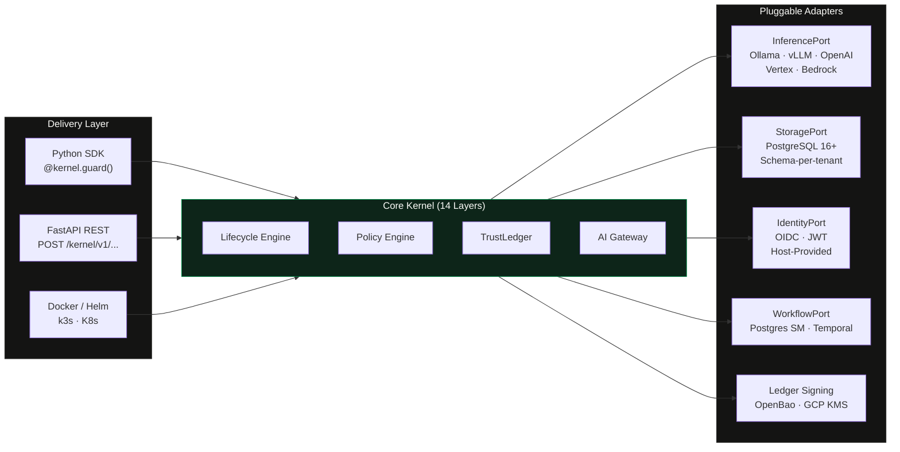
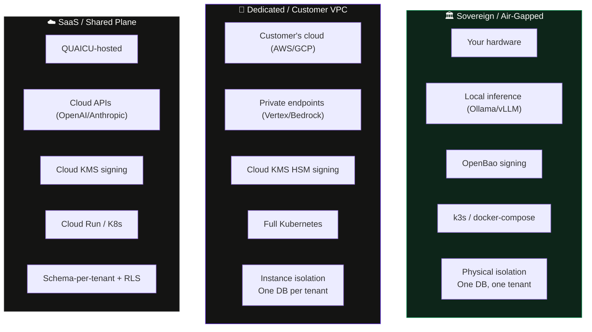
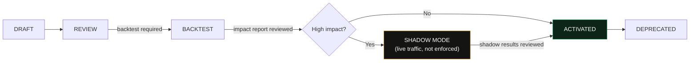

# QUAICU Governance Kernel — Architecture Overview

> **Audience:** Clients · Sales · Engineering · Compliance · Leadership  
> **Version:** 1.0 · June 2026  
> **One line:** A standalone, fail-closed governance engine that makes every AI-driven action policy-compliant, auditable, and cryptographically provable — *before* execution.

---

## What is the QUAICU Kernel?

Every time an AI system in your organisation makes a decision — approving credit, adjusting pricing, accessing personal data, communicating with a customer — that decision must be **governed, recorded, and provable**.

The QUAICU Kernel is a **standalone governance layer** that sits between your AI and the outside world. It ensures:

- **No AI action executes without policy evaluation.** Every action is checked against your rules.
- **No action completes without a tamper-proof receipt.** Every outcome is cryptographically sealed.
- **If anything goes wrong, the answer is always DENY.** The system never fails open.

Think of it as **Ring 0 for AI** — the innermost, non-bypassable layer of governance.

```
  "When the regulator asks 'why did your AI do that, and who approved it?'
   — you have the cryptographic receipt."
```

---

## How Every Action Flows (The Lifecycle)

Every AI-driven action follows this exact sequence. No step can be skipped. No shortcut exists.


| Step | What happens | What governs it | Failure behaviour |
|------|-------------|-----------------|-------------------|
| **Propose** | An action enters the system with an idempotency key | Lifecycle Engine | Duplicate key → returns existing result, never re-executes |
| **Evaluate** | All applicable policies are run (CEL, sandboxed) + consent checked + model registry verified | K·01 Policy + K·04 Consent + K·08–K·11 Assurance | Any policy error → **DENY** |
| **Gate** | If a policy returns `require_approval`, a human must approve | K·03 HITL Gate | Timeout → **REJECTED** (never auto-approve) |
| **Execute** | The actual state change happens via a durable workflow | K·06 Process Engine | Workflow failure → **HALT** |
| **Seal** | The completed action is written to an RFC 6962 Merkle transparency log with an HSM-signed proof | K·02 TrustLedger | Seal failure → action is **HALTED**, never released |
| **Emit** | A structured event is published (for downstream systems) | K·07 Event Bus | Emit failure → logged, but **never rolls back** a sealed outcome |

> [!IMPORTANT]
> **Fail-Closed Guarantee:** If *any* step fails, times out, or errors — the action is **DENIED or HALTED**. The kernel never fails open. An ungoverned action is, by definition, a compliance breach.

---

## Architecture: One Core, Four Layers

The kernel uses a **hexagonal (ports & adapters)** architecture. This means the core logic never depends on any specific database, model provider, or deployment target. Everything is swappable via configuration.

```
┌──────────────────────────────────────────────────────────────────────┐
│                       DELIVERY ADAPTERS                              │
│           Python SDK  ·  FastAPI / REST  ·  Docker Image             │
│                    (thin wrappers over core)                         │
├──────────────────────────────────────────────────────────────────────┤
│                         CORE KERNEL                                  │
│              One codebase · Zero forks · Zero domain imports         │
│     ┌───────────────────────────────────────────────────────┐        │
│     │  Lifecycle Spine + 14 Governance Layers + Port APIs   │        │
│     └───────────────────────────────────────────────────────┘        │
├──────────────────────────────────────────────────────────────────────┤
│                      PLUGGABLE ADAPTERS                              │
│  Inference · HITL · Identity · Storage · Workflow · Ledger Signing   │
│                    (selected by configuration)                       │
├──────────────────────────────────────────────────────────────────────┤
│                       CONTENT PACKS                                  │
│            Policy Packs (CEL)  ·  Regulatory Maps (RBI, EU AI Act)   │
│                        (data, not code)                              │
└──────────────────────────────────────────────────────────────────────┘
```

**Key principle:** Onboarding a new customer = pick a deployment mode + set adapters in config + load relevant content packs. **No core code is ever touched.**

### Why this matters for clients

| Concern | How the architecture addresses it |
|---------|----------------------------------|
| "We use AWS, not GCP" | Swap the adapter in config. Core is unchanged. |
| "We need on-premise, air-gapped" | Deploy the sovereign tier. Same kernel, different wrapper. |
| "Our compliance rules are different" | Load a different content pack. No code change. |
| "We need to use our own identity provider" | Plug in the OIDC adapter (Okta, Auth0, Keycloak supported). |
| "Can we add our own model provider?" | Write a new adapter implementing `InferencePort`. Core is untouched. |

---

## The 14 Governance Layers

The kernel is not a single safety hook. It is a unified, 14-layer governance stack where each layer has a specific responsibility:

```mermaid
block-beta
    columns 7
    
    block:core["CORE GOVERNANCE"]:7
        K01["K·01\nPolicy\nEngine"]
        K02["K·02\nTrust\nLedger"]
        K03["K·03\nHITL\nGate"]
        K04["K·04\nDPDP\nConsent"]
        K05["K·05\nAI\nGateway"]
        K06["K·06\nProcess\nEngine"]
        K07["K·07\nEvent\nBus"]
    end

    block:extended["EXTENDED GOVERNANCE"]:7
        K08["K·08\nModel\nRegistry"]
        K09["K·09\nFairness"]
        K10["K·10\nDrift\nMonitor"]
        K11["K·11\nExplain\nability"]
        K12["K·12\nIncident\nEngine"]
        K13["K·13\nSandbox"]
        K14["K·14\nRegulatory\nMapping"]
    end

    style core fill:#0d2519,stroke:#008746
    style extended fill:#141413,stroke:#2a2a28
```



### Layer-by-Layer Summary

| Layer | Name | What it does (plain English) | Who cares most |
|-------|------|------------------------------|----------------|
| **K·01** | **Policy Engine** | Evaluates every action against your rules (written in CEL — safe, sandboxed, deterministic). Resolves conflicts automatically: deny always wins. | Compliance · Risk |
| **K·02** | **TrustLedger** | Creates a tamper-proof record (RFC 6962 Merkle tree) for every governed action. Generates cryptographic inclusion & consistency proofs. HSM-signed. | Audit · Regulators |
| **K·03** | **HITL Gate** | Pauses high-risk actions for human approval. Survives restarts. Timeout = rejection (never auto-approves). | Risk Officers · Ops |
| **K·04** | **DPDP Consent** | Checks user consent at decision-time. Missing / expired / withdrawn consent → automatic DENY. | Legal · DPO |
| **K·05** | **AI Gateway** | Routes model calls, masks PII before transmission, enforces per-tenant cost budgets, and logs every prompt. An unlogged model call = a denied call. | Engineering · Security |
| **K·06** | **Process Engine** | Runs durable workflows that survive crashes and restarts. Two adapters: Postgres state-machine (simple) or Temporal (enterprise). | Engineering · Ops |
| **K·07** | **Event Bus** | Emits structured events *only after* a successful seal. Never alters a sealed outcome. At-least-once delivery. | Integration · Analytics |
| **K·08** | **Model Registry** | Per-tenant model allowlists. The AI Gateway enforces them. Unapproved model → automatic DENY. | Security · Compliance |
| **K·09** | **Fairness** | Runs background sweeps to detect bias across historical decisions. Feeds into policy impact reports. | Ethics · Compliance |
| **K·10** | **Drift Monitor** | Detects when model behaviour drifts from a recorded baseline. Breaches trigger K·12 incidents. | ML Engineering · Risk |
| **K·11** | **Explainability** | Reconstructs *why* any past decision was made, from sealed inputs — without re-calling the model. | Audit · Legal |
| **K·12** | **Incident Engine** | Handles post-breach rollbacks *as governed actions* (fully audited, no back-doors). | Security · Ops |
| **K·13** | **Sandbox** | Runs "what if" scenarios: test candidate policies against historical data before they go live. Zero production side-effects. | Policy Authors · Risk |
| **K·14** | **Regulatory Mapping** | Maps your policies to regulatory requirements (RBI, EU AI Act, DPDP). Generates signed evidence packs for auditors. | Compliance · Legal |

> [!NOTE]
> **All 14 layers are built and green in the test suite.** K·01–K·08 are the most heavily exercised
> (the production-live governance core). K·09–K·14 (the fairness/drift/explainability assurance sweeps,
> incident rollback, sandbox, and regulatory mapping) are built on that same foundation; some of their
> *managed* cloud integrations are validated against fake clients rather than live cloud APIs — a
> design-partner pilot is where those first run against a real environment.

---

## Port Interfaces — How the Kernel Stays Portable

The core kernel communicates with the outside world exclusively through **port interfaces**. Think of ports as electrical sockets — the kernel defines the socket shape; adapters are the plugs that connect to specific services.



| Port | What it abstracts | Available adapters |
|------|-------------------|--------------------|
| `InferencePort` | Model calls (LLM generation) | Ollama, vLLM, TGI, OpenAI, Anthropic, Gemini, AWS Bedrock, Azure OpenAI, Google Vertex |
| `StoragePort` | Database access (kernel-owned tables only) | PostgreSQL 16+ with pgvector |
| `IdentityPort` | Actor resolution (who is making this request?) | OIDC (Okta/Auth0/Keycloak), JWT, Host-Provided |
| `WorkflowPort` | Durable workflow execution | Postgres state-machine (sovereign), Temporal (dedicated/cloud) |
| `HITLPort` | Human-in-the-loop approval routing | Webhook, Email, Slack, In-App |
| `ConsentPort` | User consent verification | Built-in consent engine |
| `EventBusPort` | Event emission after seal | In-memory, GCP Pub/Sub, Cloud Logging sink |

> [!TIP]
> **For engineering teams:** Adding a new model provider (e.g., a future Mistral API) means writing one adapter file implementing `InferencePort`. Zero changes to core. Zero changes to any other adapter.

---

## Deployment Tiers

The same kernel image serves three distinct deployment models. The difference is adapters and orchestration — never core code.



| | **Sovereign** | **Dedicated** | **SaaS Shared** |
|---|---|---|---|
| **Who hosts** | Customer (their hardware) | Customer (their VPC) | QUAICU |
| **Network** | Air-gapped / on-premise | Private VPC, no egress | Internet-connected |
| **Inference** | Ollama / vLLM (local) | Vertex AI / Bedrock (private) | OpenAI / Anthropic / Gemini |
| **Database** | Single DB, single tenant | One DB instance per tenant | Shared instance, schema-per-tenant |
| **Isolation** | Physical | Instance-level | Schema + Row-Level Security |
| **Signing** | OpenBao (Ed25519) | GCP Cloud KMS (ECDSA P-256, FIPS 140-2 L3) | GCP Cloud KMS |
| **Orchestration** | k3s / docker-compose | Full Kubernetes | Cloud Run / K8s |
| **Best for** | Banks, defence, regulated sovereign | Large enterprises with cloud teams | SaaS, startups, agencies |

---

## Security Guarantees (Core Invariants)

These are not aspirational goals — they are **testable properties** enforced by automated test suites at every build.

| Invariant | What it means | How it's tested |
|-----------|---------------|-----------------|
| **Fail-Closed** | Any failure → DENY/HALT. Never allow. | Faults injected at every layer; verified to produce DENY |
| **No Bypass** | No code path executes without evaluation + gating. Even admin actions are governed. | Property-based tests prove no lifecycle shortcut exists |
| **Determinism** | Same inputs → same policy decision. Always. | No wall-clock, no randomness in evaluation paths |
| **Total Conflict Resolution** | Policies never return "undefined". Deny > require_approval > allow. | Exhaustive test suite over conflict scenarios |
| **Tenant Isolation** | Nothing crosses a tenant boundary. Ever. | Adversarial cross-tenant tests at every layer |
| **Ledger Immutability** | A sealed entry is never modified. Proofs remain verifiable forever. | Append-only DB constraints + proof verification tests |
| **Idempotency** | Re-submitting the same action never double-executes, double-seals, or double-emits. | Replay tests with duplicate idempotency keys |
| **Replay Fidelity** | Any governed action can be re-derived from the ledger. Replay never causes external effects. | Side-effect-freedom tests on every replay path |

> [!CAUTION]
> **For compliance teams:** A governance kernel that fails open is worse than no kernel — it manufactures false assurance. Every invariant above is automatically verified before any release.

---

## Technology Stack

| Concern | Choice | Why this choice |
|---------|--------|-----------------|
| Core language | **Python 3.11+** | AI ecosystem alignment · type-safe (mypy strict) |
| API framework | **FastAPI** | Async-native · auto-generated OpenAPI docs · middleware stack |
| Database | **PostgreSQL 16+ (pgvector)** | ACID guarantees · schema-per-tenant · RLS · vector embeddings |
| Policy language | **CEL** (Common Expression Language) | Deterministic · non-Turing-complete (always terminates) · sandboxed · proven in Kubernetes |
| Audit ledger | **RFC 6962 Merkle Transparency Log** | Efficient inclusion/consistency proofs · industry standard (Certificate Transparency) |
| Secrets management | **OpenBao** (MPL 2.0) | Open-source (no BSL restrictions) · API-compatible with Vault · free multi-tenancy |
| Workflow engine | **Temporal + Postgres state-machine** | Durable execution · replay-safe · tiered by deployment |
| Cryptographic signing | **OpenBao Ed25519 / GCP Cloud KMS** | HSM-backed · algorithm-aware verifier · offline verification |
| Schema migrations | **Alembic** | Kernel owns its own schema — never touches host tables |
| Observability | **OpenTelemetry + Prometheus + Grafana + Loki** | Traces + metrics + logs · vendor-neutral |
| Infrastructure | **OpenTofu** | MPL 2.0 (no BSL) · Terraform-compatible |
| Orchestration | **k3s / docker-compose / K8s** | Tiered to customer size · identical kernel image |
| Admin console | **React 19 + TypeScript** | Operator dashboard · policy management · ledger explorer |

---

## Policy System (How Rules Work)

Policies are stored as **data, not code**. They use CEL (Common Expression Language), which is deterministic, sandboxed, and guaranteed to terminate. No `eval()`, no arbitrary code, no side effects.

**Example policy:**

```yaml
id: credit.high_value_approval
version: 3
governs: credit.approve                    # action type this policy applies to
scope: { tenant: "*" }                     # applies to all tenants
condition: |                               # CEL — safe, bounded, sandboxed
  action.payload.amount > 5000000
  && action.actor.roles.exists(r, r == "underwriter")
decision: require_approval                 # allow | deny | require_approval
approvers: ["role:risk_head"]
regulatory_refs: ["rbi.ifrs9.staging"]     # links to K·14 regulation catalog
lifecycle: ACTIVATED                       # DRAFT → REVIEW → ACTIVATED → DEPRECATED
```

**Policy lifecycle safeguards:**



> [!IMPORTANT]
> **No policy enforces until simulated.** Every policy must pass a backtest (historical replay) before activation. High-impact changes require a shadow-mode window where the new policy evaluates live traffic without enforcing — so you see the impact before it's real.

---

## Multi-Tenancy & Data Isolation

Data isolation is a foundational guarantee, not a feature flag. The architecture makes cross-tenant data leakage **structurally impossible**.

| Mechanism | What it does |
|-----------|-------------|
| **Schema-per-tenant** | Each tenant gets its own database schema with its own tables. Not a `tenant_id` column — entirely separate table sets. |
| **Per-tenant ledger** | The TrustLedger is *always* per-tenant tables inside the tenant's schema. Never a shared ledger table. Cross-tenant ledger contamination is impossible by construction. |
| **Row-Level Security (RLS)** | Enabled as defence-in-depth *even under* schema-per-tenant. A mis-filtered query hits an empty set, not another tenant's data. |
| **Connection isolation** | Per-tenant connection pools. `SET LOCAL app.current_tenant` on every transaction. |
| **Adversarial testing** | Every layer is tested with cross-tenant attack scenarios. |

---

## Codebase at a Glance

These metrics are extracted from the live knowledge graph of the codebase (3,480 nodes, 19,207 dependency edges, 393 source files).

| Metric | Value |
|--------|-------|
| Source files | 393 |
| Code nodes (classes, functions, modules) | 3,480 |
| Dependency edges | 19,207 |
| Architectural communities detected | 1,734 |
| Core abstraction hub nodes | `types`, `LifecycleEngine`, `PolicyEngine`, `TrustLedger`, `AIGateway` |

**Key architectural patterns verified by graph analysis:**

| Pattern | What the graph confirms |
|---------|------------------------|
| Hexagonal Port Contract Surface | `ConsentPort`, `HITLPort`, `IdentityPort`, `InferencePort`, `StoragePort`, `WorkflowPort` — extracted as a cohesive hyperedge (0.95 confidence) |
| Policy Engine Components | `PolicyEngine`, `PolicyEnvelope`, `PolicyLifecycle`, `ImpactReport`, `PolicyRepository` form a tightly-coupled component |
| RFC 6962 Merkle Ledger | `TrustLedger`, `MerkleTree`, `LedgerRepository`, `SignedTreeHead`, `TreeSigner` form a self-contained, standard-compliant component |
| AI Gateway Enforcement | Model allowlist, budget tracker, prompt log, and masking config form four distinct enforcement layers |
| Lifecycle Collaborator Chain | `LifecycleEngine` → `PolicyEvaluator` → `Ledger` → `EventBus` → `ActionRepository` — the governed action flow is a verified chain |
| SDK Delivery Surface | `Kernel`, `BoundAgent`, `TieredKernelProvider`, `GovernedProxy` — the SDK wraps core without leaking internals |

---

## Integration: Three Modes, Same Governance

### 1. Python SDK (Embed in your app)

```python
@kernel.guard(policy="credit.approve")
async def approve_credit_line(loan_id: str, amount: float) -> dict:
    return {"status": "approved", "loan_id": loan_id, "amount": amount}
```

Zero changes to your function signature. The kernel wraps it transparently.

### 2. REST API (Any language)

```bash
curl -X POST https://your-kernel/kernel/v1/propose \
  -H "Authorization: Bearer qk_live_..." \
  -d '{"action_type": "credit.approve", "payload": {"amount": 75000}}'
```

Full OpenAPI documentation auto-generated at `/docs`.

### 3. Docker (Fastest path, zero language dependency)

```yaml
services:
  quaicu-kernel:
    image: quaicu/kernel:latest
    ports: ["8000:8000"]
    environment:
      - KERNEL_HOST=0.0.0.0
```

Up and running in 60 seconds. Interactive docs at `localhost:8000/docs`.

---

## Regulatory Coverage

The kernel ships with starter content packs for key regulatory frameworks. Evidence packs are **point-in-time correct** — they reflect the rules as they stood when the action occurred, not as they stand today.

| Regulation | Coverage | Evidence format |
|-----------|----------|-----------------|
| **RBI FREE-AI** | Governance, transparency, fairness requirements | Signed evidence pack (human-readable + machine-readable + Merkle proofs) |
| **EU AI Act** (Regulation 2024/1689) | High-risk AI system requirements, transparency obligations | Point-in-time policy↔regulation mapping with inclusion proofs |
| **India DPDP Act 2023** | Consent management, purpose limitation, data principal rights | Consent state sealed at decision-time, replay-verifiable |
| **NAAC** | Institutional governance, quality assurance | Regulatory mapping with signed evidence |

> [!NOTE]
> Adding a new regulation = adding a new content pack (a versioned catalog of requirements + policy mappings). No code change. No core modification.

---

## Frozen Architecture Decisions

These 11 decisions are **settled and foundational**. They do not change via code review — only through a formal Architecture Decision Record (ADR) with leadership sign-off. They exist because reopening any one destabilises the entire system.

| # | Decision | What it prevents |
|---|----------|-----------------|
| F-01 | **One core, no forks** | "Let's fork a bank-specific build" |
| F-02 | **Governance is the product — model-agnostic** | "Let's bundle our own models" |
| F-03 | **Fail-closed everywhere** | "Let it through if the policy service is slow" |
| F-04 | **No bypass — governance is total** | "Add a fast-path that skips the kernel" |
| F-05 | **CEL is the policy language** | "Allow Python expressions / embed raw Rego" |
| F-06 | **RFC 6962 transparency log — no custom proofs** | "Design our own proof format" |
| F-07 | **Per-tenant ledger, always** | "Consolidate ledgers into one shared table" |
| F-08 | **Ports and adapters (hexagonal)** | "Call this SDK directly from core" |
| F-09 | **Replay-safe, side-effect-free** | "Recompute model calls on replay" |
| F-10 | **Simulation before enforcement** | "Push this policy straight to production" |
| F-11 | **Config over code** | "Just add a small `if` for this one customer" |

---

## Summary for Different Audiences

### For Clients & Sales

- **What you get:** A tamper-proof governance layer for your AI — deployed on your terms (cloud, on-prem, or air-gapped).
- **Why it matters:** When the regulator asks "why did your AI do that?", you hand them a cryptographic receipt, not a log file.
- **How you integrate:** 3 lines of code (SDK), a REST call (API), or a `docker compose up` (container).
- **What you don't do:** Fork the code, write custom governance logic, or hire a team to maintain it.

### For Engineering

- **Architecture:** Hexagonal, 14 layers, strict port interfaces. Core imports zero concrete libraries.
- **Stack:** Python 3.11+ / FastAPI / PostgreSQL 16+ / CEL / Alembic / OpenTelemetry.
- **Testing:** Conformance + property-based + fault-injection + adversarial tenant isolation. K·02 at 95% coverage; K·01/K·03/K·04 at 90%.
- **Extension:** Write an adapter implementing a port Protocol. Zero core changes.

### For Compliance & Legal

- **Audit trail:** Every governed action produces an RFC 6962 Merkle inclusion proof, HSM-signed.
- **Consent:** DPDP-aligned consent checked at decision-time. Missing consent = automatic denial.
- **Evidence:** Point-in-time evidence packs map policies to regulations as they stood at the time of the action.
- **Immutability:** Sealed ledger entries cannot be modified. Proofs remain verifiable for the life of the product.
- **Third-party review:** The ledger implementation will undergo an independent cryptographic review before any bank deployment.

---

<p align="center">
  <strong>QUAICU Governance Kernel</strong><br>
  <em>Because "trust us, the AI is fine" does not pass an audit.</em>
</p>
