# ALIS — Autonomous Learning & Institution-Management System

## Complete System Documentation

> **Version**: 1.2 | **Date**: 2026-04-13 | **Status**: Production-Ready + Performance Hardened
>
> ALIS is a **policy-driven, AI-augmented Enterprise Resource Planning (ERP) system** purpose-built for universities and higher-education institutions. It runs autonomously — AI agents propose decisions, deterministic rules enforce them, and staff only handle exceptions.

### 📋 New Team Members — Start Here

| Step | Document | Purpose |
|------|----------|---------|
| 1 | [CONTRIBUTING.md](../CONTRIBUTING.md) | Branch strategy, PR workflow, code review rules |
| 2 | [ONBOARDING.md](./ONBOARDING.md) | Dev environment setup, role-specific guides |
| 3 | [CODEBASE_MAP.md](./CODEBASE_MAP.md) | Every file and folder explained with dependencies |
| 4 | **This document** | Deep architectural reference (read after the above) |

---

## Table of Contents

1. [High-Level Architecture](#1-high-level-architecture)
2. [System Topology & Service Map](#2-system-topology--service-map)
3. [The 6-Layer Enforcement Model](#3-the-6-layer-enforcement-model)
4. [Backend — File-by-File Breakdown](#4-backend--file-by-file-breakdown)
5. [Frontend — File-by-File Breakdown](#5-frontend--file-by-file-breakdown)
6. [SaaS Platform (Control Plane, AI Service)](#6-saas-platform)
7. [Infrastructure & DevOps](#7-infrastructure--devops)
8. [Database — Complete Schema](#8-database--complete-schema)
9. [AI & Agent Architecture](#9-ai--agent-architecture)
10. [Domain Event Flows](#10-domain-event-flows)
11. [Dependencies & Libraries](#11-dependencies--libraries)
12. [Security Architecture](#12-security-architecture)
13. [Deployment & CI/CD](#13-deployment--cicd)
14. [Performance Optimization Layer](#14-performance-optimization-layer)

---

## 1. High-Level Architecture

ALIS is a **multi-tenant SaaS platform** with three independently deployable microservices, a React SPA frontend, and a full observability stack.

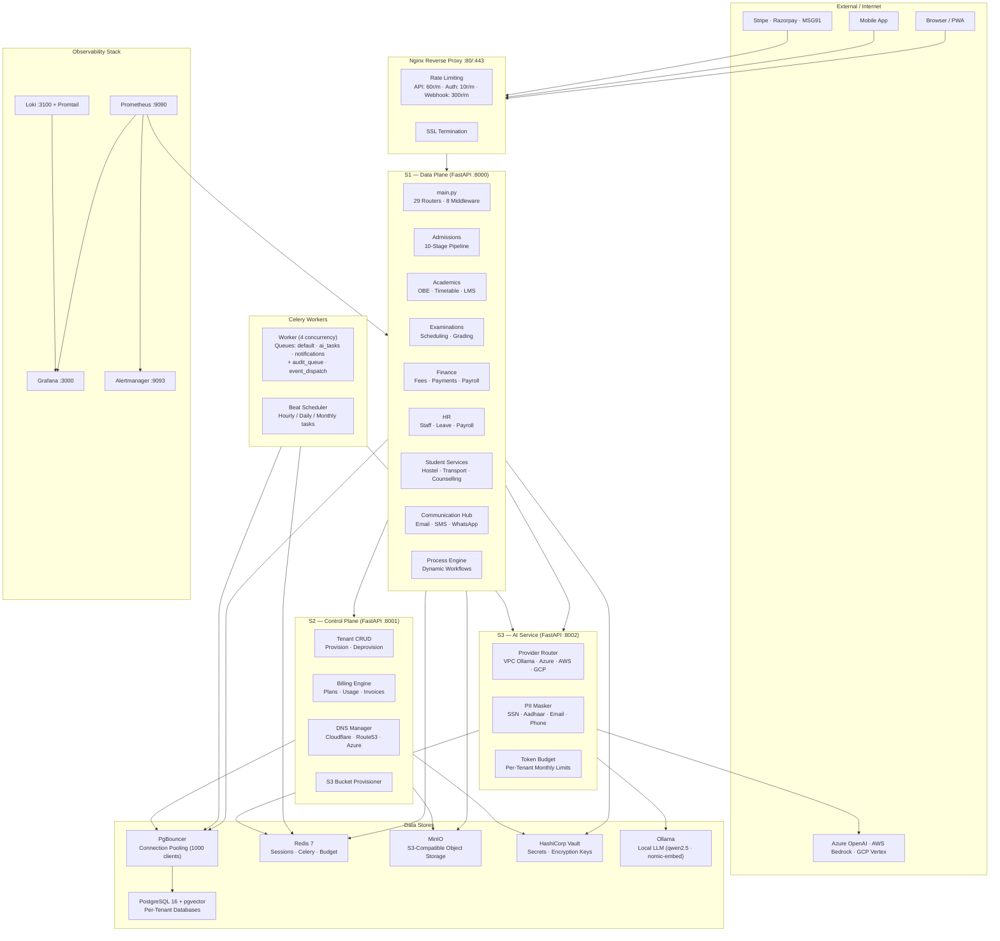

---

## 2. System Topology & Service Map

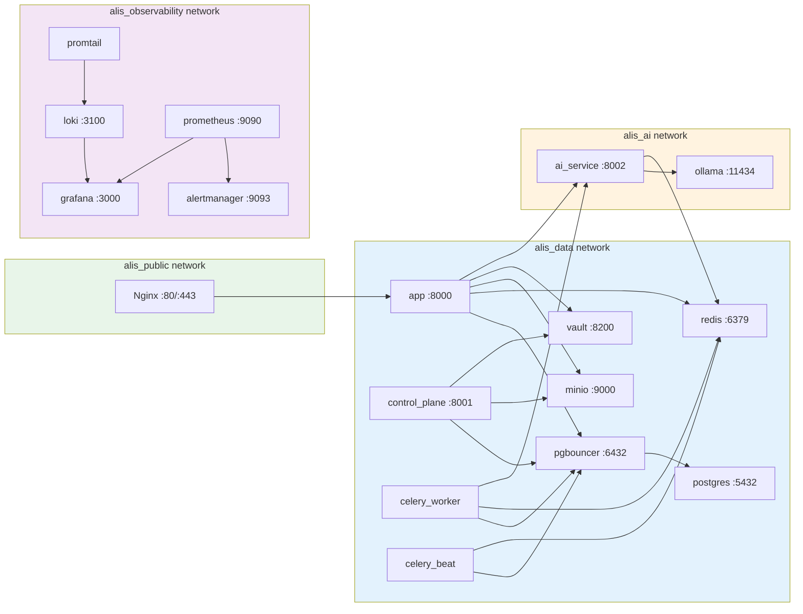

### Service Inventory

| Service | Image | Port | Purpose | Workers |
|---------|-------|------|---------|---------|
| **app** | `./ALIS/Dockerfile` | 8000 | Main FastAPI data plane | 4 uvicorn |
| **control_plane** | `./control_plane/Dockerfile` | 8001 | SaaS tenant lifecycle | 2 uvicorn |
| **ai_service** | `./ai_service/Dockerfile` | 8002 | Centralized AI inference | 2 uvicorn |
| **celery_worker** | `./ALIS/Dockerfile` | — | Background job processor | 4 concurrency |
| **celery_beat** | `./ALIS/Dockerfile` | — | Periodic task scheduler | 1 |
| **postgres** | `pgvector/pgvector:pg16` | 5432 | Primary RDBMS + vector | — |
| **pgbouncer** | `edoburu/pgbouncer` | 6432 | Connection pooler | 80 pool / 1000 max |
| **redis** | `redis:7-alpine` | 6379 | Broker, cache, sessions, budget | — |
| **ollama** | `ollama/ollama` | 11434 | Local LLM inference | GPU optional |
| **minio** | `minio/minio` | 9000/9001 | S3-compatible file storage | — |
| **vault** | `hashicorp/vault:1.17` | 8200 | Secret management (Raft) | — |
| **nginx** | `nginx:alpine` | 80/443 | Reverse proxy + SSL | auto |
| **prometheus** | `prom/prometheus:v2.54.0` | 9090 | Metrics scraping | — |
| **grafana** | `grafana/grafana:11.2.0` | 3000 | Dashboards | — |
| **loki** | `grafana/loki:3.1.0` | 3100 | Log aggregation | — |
| **promtail** | `grafana/promtail:3.1.0` | — | Log shipper | — |
| **alertmanager** | `prom/alertmanager:v0.27.0` | 9093 | Alert routing | — |

---

## 3. The 6-Layer Enforcement Model

ALIS enforces governance through six mandatory layers. Every request passes through all layers — no shortcuts.

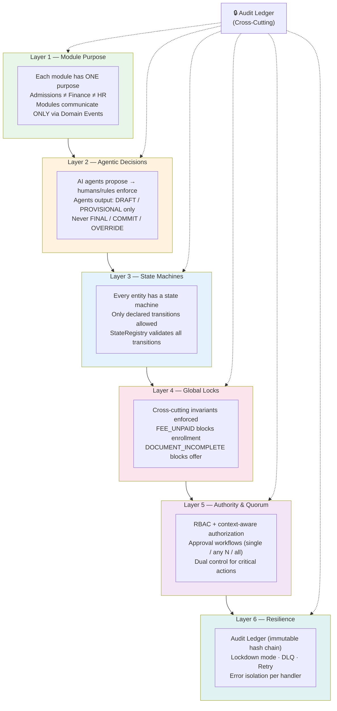

---

## 4. Backend — File-by-File Breakdown

### 4.1 Server Root Files

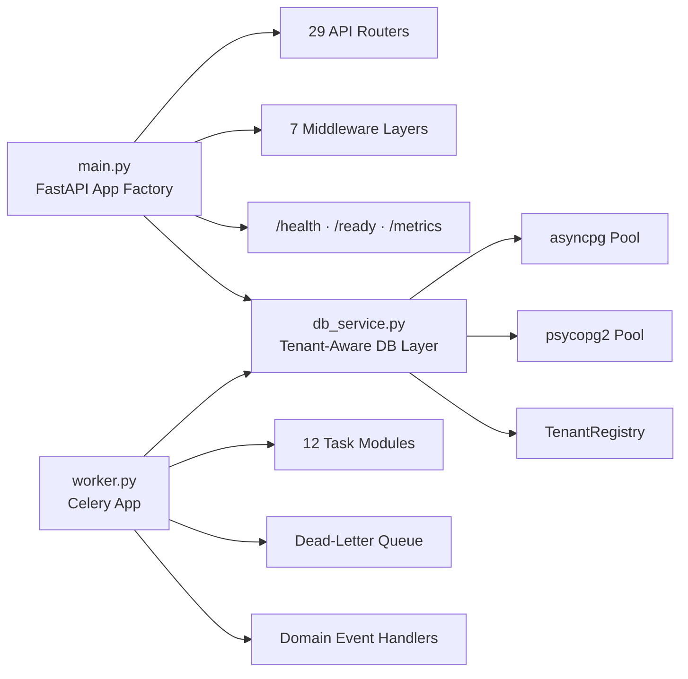

| File | Purpose | Key Exports | Connects To |
|------|---------|-------------|-------------|
| `server/main.py` | FastAPI application factory. Mounts all 29 routers, registers 7 middleware (Security Headers → Metrics → Logging → Subdomain Tenant → Shadow Mode → Consent → CORS → Deprecation), exposes `/health`, `/ready`, `/metrics` endpoints. Manages asyncpg pool lifecycle via lifespan. | `create_app()` | Every router, every middleware, db_service |
| `server/db_service.py` | Centralized tenant-aware database access. Maintains per-tenant asyncpg and psycopg2 connection pools (lazy-initialized, lock-protected). Enforces tenant isolation via PostgreSQL `SET alis.current_tenant`. | `execute_query()`, `execute_transaction()`, `execute_query_async()`, `execute_system_query()`, `DBRouter` | core/settings, core/tenant_registry |
| `server/worker.py` | Celery application with 3 queues (default, high_priority, dead_letter). Registers all domain event handlers at worker startup. Failed tasks auto-written to DLQ table. | `celery_app` | 12 task modules, core/settings, core/tenant_tasks |
| `server/fs_service.py` | MinIO-backed file storage service. Upload, download, delete, presigned URLs. | `FSService` | core/settings (MinIO config) |

### 4.2 Core Infrastructure (`server/core/`) — 56 Files

```mermaid
graph TB
    subgraph Security["Authentication & Security"]
        Sec["security.py<br/>Sessions · Passwords · MFA"]
        MFA["mfa_service.py<br/>TOTP Enrollment & Verify"]
        Lock["lockdown.py<br/>Incident Response"]
        Esc["escalation.py<br/>Privilege Elevation"]
        Over["overrides.py<br/>Policy Exception Handling"]
    end

    subgraph RBAC["Authorization"]
        R["rbac.py<br/>10+ Roles · 50+ Permissions"]
        App["approvals.py<br/>Quorum-Based Approval"]
    end

    subgraph AI["AI Governance"]
        GW["ai_gateway.py<br/>Single AI Entry Point"]
        Guard["guardrails.py<br/>Output Validation"]
        HITL["hitl.py<br/>Human Escalation"]
        Obs["ai_observability.py<br/>Execution Tracing"]
        Prov["ai_providers.py<br/>Ollama · OpenAI · NVIDIA"]
        PR["prompt_registry.py<br/>Version-Controlled Prompts"]
        MR["model_registry.py<br/>Model Metadata"]
        LLM["llm_router.py<br/>Tiered Model Selection"]
    end

    subgraph Data["Data Governance"]
        DC["data_classification.py<br/>Sensitivity Levels"]
        Diff["diff_tracker.py<br/>Field-Level Changes"]
        Ret["retention_policy.py<br/>Archival & Purging"]
        TC["tenant_crypto.py<br/>Per-Tenant Encryption"]
    end

    subgraph Events["Event & Workflow"]
        DE["domain_events.py<br/>DB-Backed Event Bus"]
        EV["events.py<br/>In-Process Event Bus"]
        WF["workflow.py<br/>Abstract Workflow Base"]
        WS["workflow_schema.py<br/>Workflow Context Models"]
        SR["state_registry.py<br/>State Machine Validation"]
        LK["locks.py<br/>Global Invariant Locks"]
    end

    subgraph Policy["Policy Engine"]
        PE["policy_engine.py<br/>Safe Expression Evaluator"]
        PS["policy_service.py<br/>Policy Lifecycle"]
        PSt["policy_store.py<br/>Policy Persistence"]
        PRe["policy_resolver.py<br/>Runtime Evaluation"]
        PA["policy_authoring_agent.py<br/>AI Co-Author"]
    end

    subgraph Config["Configuration"]
        Set["settings.py<br/>Pydantic Settings"]
        Cfg["config.py<br/>Business Policy Registry"]
        FF["feature_flags.py<br/>Feature Toggles"]
        TR["tenant_registry.py<br/>Multi-Tenant Config"]
        VC["vault_client.py<br/>HashiCorp Vault"]
    end

    subgraph Infra["Infrastructure"]
        Audit["audit.py<br/>Hash-Chain Audit Ledger"]
        Met["metrics.py<br/>Prometheus Metrics"]
        Mod["models.py<br/>User · Org Entities"]
        Sch["schema.py<br/>Base Event Schema"]
        Exc["exceptions.py<br/>Exception Hierarchy"]
        EH["error_handlers.py<br/>Global Error Handlers"]
        Not["notifications/<br/>Email · SMS · WhatsApp"]
        Doc["documents/<br/>PDF Generation"]
    end

    GW --> Guard
    GW --> HITL
    GW --> Obs
    GW --> Prov
    GW --> PR
    GW --> MR
    GW --> LLM
    Sec --> Audit
    R --> App
    DE --> EV
    WF --> SR
    WF --> LK
    WF --> App
    PE --> PS
```

#### Core Files — Detailed Reference

| File | Purpose | Key Classes / Functions |
|------|---------|----------------------|
| **settings.py** | Pydantic `BaseSettings` for all infrastructure config. Reads from `.env`. Categories: DB, Redis, Celery, MinIO, Ollama, External LLM, MFA, JWT, SMTP, SMS. | `Settings` singleton |
| **security.py** | Password hashing (bcrypt + legacy PBKDF2), secure token generation, Redis-backed session management, failed login tracking, account lockout, MFA challenge flow. | `PasswordHasher`, `TokenGenerator`, `create_session()`, `get_session()`, `revoke_session()`, `check_failed_logins()`, `check_lockout()` |
| **audit.py** | Immutable, append-only audit ledger with SHA-256 hash chaining. Advisory locks prevent hash-chain forks. 40+ audit action types. PostgreSQL triggers block UPDATE/DELETE/TRUNCATE. | `AuditLog.log()`, `AuditLog.verify_chain()`, `AuditAction` enum (CREATE, LOGIN, AI_INVOCATION, GUARDRAIL_BLOCKED, LOCKDOWN_ACTIVATED, etc.) |
| **domain_events.py** | DB-backed, Celery-dispatched cross-module event bus. Events persisted to `domain_events` table first (durable), then dispatched to Celery. Retry up to 3× with backoff. | `DomainEventBus.publish()`, `DomainEventBus.subscribe()`, `DomainEvent` dataclass |
| **events.py** | In-process publish/subscribe for local signaling. Error isolation — one handler failing doesn't crash others. | `EventBus.subscribe()`, `EventBus.publish()`, `@EventBus.listen()` decorator |
| **rbac.py** | 10+ roles (STUDENT → SUPER_ADMIN + AI_AGENT + SYSTEM), 50+ granular permissions (resource:action pattern). Default-deny posture. | `Role` enum, `Permission` enum, `verify_access()`, `@require_permission()` decorator, `ContextAwareAuthorizer` |
| **models.py** | Canonical identity entities. `BaseEntity` with immutable UUID, versioning, audit timestamps, data classification. | `User`, `Organization`, `ActorType` (HUMAN/AI_AGENT/SYSTEM), `UserStatus`, `BaseEntity` |
| **state_registry.py** | Central state machine validation. `StudentState` has 14 states across 10 admissions stages. | `StateRegistry.validate_transition()`, `StudentState` enum, `TransitionResult` |
| **locks.py** | Global invariant enforcement. 7 lock types prevent invalid cross-module operations. | `check_global_locks()`, `acquire_lock()`, `release_lock()`, `LockType` enum |
| **ai_gateway.py** | Single entry point for all AI calls. Enforces: prompt injection detection, JSON schema validation, STATE_IMPACT invariant (no FINAL/COMMIT/OVERRIDE), confidence scoring, PII masking. Routes to Ollama or external API based on settings. | `AIGateway.invoke()`, `AIResponseSchema`, `ConfidenceTier`, `StateImpact` |
| **guardrails.py** | Post-LLM output validation chain. JSON schema, confidence threshold, sensitive data check, profanity filter. | `GuardrailChain`, `JSONSchemaGuardrail`, `ConfidenceThresholdGuardrail`, `SensitiveDataGuardrail` |
| **hitl.py** | Human-in-the-loop escalation queue for low-confidence AI decisions. | `HITLQueue.enqueue()`, `HITLQueue.approve()`, `HITLQueue.reject()` |
| **ai_observability.py** | Traces agent execution with timing, tool calls, and decisions. Persists to `ai_execution_log`. | `AIObservabilityTracer`, `@trace_agent_execution()` |
| **ai_providers.py** | Pluggable AI provider interface. `OllamaProvider`, `OpenAIProvider`, `ProviderFactory`. | `AIProvider` (ABC), `OllamaProvider`, `OpenAIProvider` |
| **llm_router.py** | Tiered model selection: extraction (1.5B), generation (7B), reasoning (14B). | `LLMRouter.select_model()` |
| **prompt_registry.py** | Version-controlled prompt templates with variable resolution. | `PromptRegistry.get()`, `PromptRegistry.resolve()` |
| **model_registry.py** | AI model metadata (name, provider, cost, capabilities). | `ModelRegistry.register()`, `ModelRegistry.get()` |
| **tool_registry.py** | Registry of tools available to AI agents. Schema validation on tool calls. | `ToolRegistry.register()`, `ToolRegistry.verify_tool_call()` |
| **approvals.py** | Multi-approver workflow: SINGLE (any 1), ANY (N of M), ALL. | `ApprovalManager.request_approval()`, `ApprovalManager.approve()` |
| **workflow.py** | Abstract base class for all ALIS wizards. Template method pattern: check locks → check approval → execute logic → transition state. | `BaseWorkflow._execute_logic()` (abstract), `WorkflowContext` |
| **policy_engine.py** | Safe expression evaluator using `asteval` (replaces `eval()`). Used for eligibility rules, fee policies, etc. | `PolicyEngine.evaluate()` |
| **policy_service.py** | Policy lifecycle: DRAFT → SUBMITTED → APPROVED → ACTIVE. Dual control for activation. | `PolicyService.draft_policy()`, `.submit_policy()`, `.approve_policy()`, `.activate_policy()` |
| **data_classification.py** | Sensitivity levels (PUBLIC → TOP_SECRET) and regulated data types (PII, HEALTH, FINANCIAL, BIOMETRIC). Every entity carries these tags. | `SensitivityLevel`, `RegulatedDataType`, `DataClassifier` |
| **diff_tracker.py** | Field-level change tracking with audit trail. Records old → new values for every field change. | `DiffTracker.track_changes()`, `DiffTracker.get_changes()` |
| **retention_policy.py** | Data lifecycle management. Archival or hard-delete after retention period. All deletions logged to immutable audit. | `RetentionPolicyManager.apply_policy()` |
| **mfa_service.py** | TOTP-based MFA. Enroll device, verify code, manage backup codes. Secrets encrypted at rest (Fernet + Vault). | `MFAService.enroll_device()`, `MFAService.verify_totp()` |
| **escalation.py** | Temporary privilege elevation with time limit and audit trail. | `EscalationManager.request_escalation()`, `DualControlManager` |
| **overrides.py** | Policy exception handling — request → approve → execute with full audit. | `OverrideApprovalManager.request_override()` |
| **lockdown.py** | Incident response mode — blocks all writes and AI invocations. | `activate_lockdown()`, `deactivate_lockdown()`, `is_lockdown_active()` |
| **vault_client.py** | HashiCorp Vault KV v2 client. AppRole auth. Per-tenant secret paths. | `VaultClient.get_secret()`, `VaultClient.set_secret()` |
| **tenant_registry.py** | Resolves per-tenant DB config. Fetches from control plane or uses local fallback (single-tenant). | `TenantRegistry.get_by_id()`, `TenantRegistry.get_by_domain()` |
| **tenant_crypto.py** | Per-tenant Fernet encryption (AES-128-CBC). Keys from Vault or master key. | `TenantCrypto.encrypt()`, `TenantCrypto.decrypt()` |
| **tenant_tasks.py** | Routes Celery tasks to per-tenant queues for isolation. | `TenantTaskRouter.route_for_task()` |
| **feature_flags.py** | Percentage-based rollout, org-specific toggles, rule-based evaluation. | `FeatureFlagRegistry.is_enabled()` |
| **config.py** | Institution-specific business policies (separate from infra settings). | `ConfigRegistry.get()`, `ConfigRegistry.set()` |
| **campus_service.py** | Multi-campus location management. | `CampusService` |
| **api_versioning.py** | API v1/v2 versioning with deprecation headers. | `DeprecationMiddleware` |
| **shadow_mode.py** | Dual-write testing mode for shadow DB comparison. | `ShadowModeMiddleware`, `ShadowDivergenceLogger` |
| **webhook_dispatcher.py** | Outbound webhooks with retry logic and idempotency. | `WebhookDispatcher.dispatch()` |
| **backup_service.py** | Daily database backups to MinIO/S3. | `BackupService.backup_database()` |
| **notifications/service.py** | Multi-channel notification dispatcher (Email, SMS, WhatsApp). | `NotificationDispatcher.send()` |
| **notifications/channels.py** | Transport layer: `EmailChannel` (SMTP), `SMSChannel` (MSG91/Twilio), `WhatsAppChannel`. | `Channel.send()` |
| **notifications/templates.py** | Jinja2-based template rendering for notifications. | `TemplateRegistry.render()` |
| **documents/service.py** | Document generation orchestration. Stores in MinIO. | `DocumentService.generate_document()` |
| **documents/engine.py** | HTML → PDF rendering via ReportLab. | `DocumentEngine.render()` |
| **exceptions.py** | Custom exception hierarchy: `ALISError` → `BusinessRuleViolation`, `IllegalStateTransitionError`, `PermissionDeniedError`, `GlobalLockViolationError`, `PromptInjectionError`, `AISchemaViolationError`, `GuardrailViolationError`. | All exception classes |
| **error_handlers.py** | Global FastAPI exception handlers. Returns JSON error responses with HTTP status codes. | `register_exception_handlers()` |
| **metrics.py** | Prometheus metrics: `HTTP_REQUESTS_TOTAL`, `HTTP_REQUEST_DURATION`, `ACTIVE_REQUESTS`, `DOMAIN_EVENTS_*`. | `generate_latest()` |
| **schema.py** | Base `Event` model for EventBus. | `Event` |

### 4.3 Domain Modules

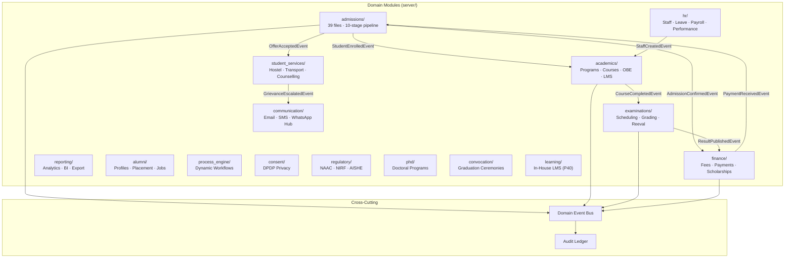

#### 4.3.1 Admissions Module (`server/admissions/`) — 39 Files, 10 Stages

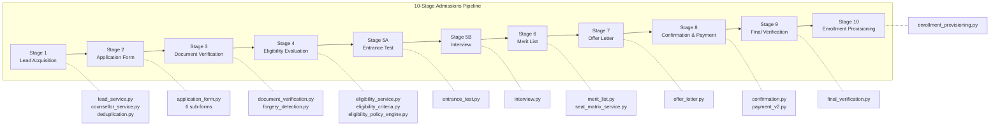

| File | Stage | Key Classes |
|------|-------|-------------|
| `lead_service.py` | 1 | `LeadService`, `ConsultantService`, `ReferralCodeService` |
| `counsellor_service.py` | 1 | `CounsellorService` — CRUD + PGVector ETL trigger |
| `counsellor_allocation.py` | 1 | `CounsellorAllocationService` — AI vector search or load balancing |
| `deduplication.py` | 1 | `LeadDeduplicationService` — Email/phone/name fuzzy match |
| `application_form.py` | 2 | `ApplicationFormService` — Multi-step wizard (6 sub-forms: personal, address, academic, entrance, preferences, declaration) |
| `document_verification.py` | 3 | `DocumentVerificationService` — Upload, verify, AI-assisted check |
| `forgery_detection.py` | 3 | AI-powered document forgery detection |
| `eligibility_service.py` | 4 | `EligibilityService` — Evaluate applicant eligibility |
| `eligibility_criteria.py` | 4 | `EligibilityCriteriaService` — Define criteria per program |
| `eligibility_policy_engine.py` | 4 | Policy engine for eligibility rules (uses `asteval`) |
| `entrance_test.py` | 5A | `AdmissionsTestService`, `TestSlotService`, `TestRegistrationService`, `TestScoreService` |
| `interview.py` | 5B | `InterviewPanelService`, `InterviewScheduleService`, `InterviewScorecardService` |
| `merit_list.py` | 6 | `MeritListService`, `SeatMatrixService`, `MeritListPolicyService` |
| `offer_letter.py` | 7 | `OfferLetterService` — PDF generation + email/SMS notification |
| `confirmation.py` | 8 | `AdmissionConfirmationService` — Seat accept/decline |
| `payment_v2.py` | 8 | `DemandDraftService`, `RefundRequestService` |
| `final_verification.py` | 9 | `FinalVerificationService` — Pre-enrollment checklist |
| `enrollment_provisioning.py` | 10 | `EnrollmentProvisioningService` — Student ID, LMS sync, hostel, library |
| `enrollment_handover.py` | 10 | `EnrollmentHandoverService` — Transition to academics |
| `readmission_service.py` | — | Readmission workflow for returning students |
| `credit_transfer_service.py` | — | Cross-institution credit transfer |
| `intake_quality.py` | — | Batch-level quality metrics |
| `review_queue.py` | — | Manual review for borderline cases |
| `reporting_gate.py` | — | Regulatory reporting |
| `automation_pipeline.py` | — | Orchestrates all stages via domain events |
| `admissions_templates.py` | — | 25+ email/SMS templates |
| `event_handlers.py` | — | Domain event subscriptions for cross-stage triggers |
| `models.py` | — | 20+ Pydantic models, `ApplicantStatus` (14 states) |
| `integrations/digilocker.py` | — | Fetch documents from DigiLocker (stub) |
| `integrations/nta_scores.py` | — | Fetch NTA entrance scores (stub) |
| `integrations/payment_gateway.py` | — | Razorpay integration |
| `integrations/sms_gateway.py` | — | MSG91/Twilio SMS |
| `integrations/email_provision.py` | — | Email account provisioning (stub) |
| `integrations/document_storage.py` | — | MinIO document storage |
| `integrations/lms_sync.py` | — | LMS enrollment sync |

#### 4.3.2 Other Domain Modules

| Module | Path | Key Files | Purpose |
|--------|------|-----------|---------|
| **Academics** | `server/academics/` | `models.py`, `programs.py`, `obe_service.py`, `ta_assignment_service.py`, `learning_service.py`, `event_handlers.py` | Programs, courses, OBE (CO-PO mapping), timetable, attendance, in-house LMS |
| **Examinations** | `server/examinations/` | `models.py`, `reeval.py`, `event_handlers.py` | Exam scheduling, hall tickets, grading, result publication, re-evaluation, AI-assisted answer evaluation |
| **Finance** | `server/finance/` | `models.py`, `einvoice_service.py`, `tally_export.py`, `event_handlers.py` | Fee structures, student invoices, multi-channel payments (Razorpay/Cash/NEFT/UPI), scholarships, waivers, e-invoicing, Tally ERP export |
| **HR** | `server/hr/` | `models.py`, `staff.py`, `performance.py`, `event_handlers.py` | Staff profiles, leave management, payroll (monthly), performance reviews, attendance tracking |
| **Student Services** | `server/student_services/` | `models.py`, `transport.py`, `counselling.py`, `event_handlers.py` | Hostel (blocks/rooms/allocation/complaints/swaps), library (books/borrowings), transport (routes/assignments), counselling (sessions/referrals) |
| **Communication** | `server/communication/` | `notif_templates.py`, `whatsapp_service.py` | Notification templates (multi-language), bulk messaging, WhatsApp integration, delivery tracking |
| **Reporting** | `server/reporting/` | `models.py` | Saved reports, export jobs (CSV/XLSX/PDF), KPI snapshots, custom BI queries |
| **Alumni** | `server/alumni/` | `profiles.py`, `models.py` | Alumni profiles, placement records, job board, recruitment drives, mentorship |
| **Process Engine** | `server/process_engine/` | `definition.py`, `executor.py`, `instance.py`, `forms.py`, `event_handlers.py` | Dynamic BPMN-like process definitions. Step types: FORM, APPROVAL, CONDITION, NOTIFICATION, AI_EVALUATION, AUTO_ACTION. Safe expression evaluator for conditions. |
| **Consent** | `server/consent/` | `consent_middleware.py` | DPDP Act 2023 consent tracking. Blocks PII access without consent. |
| **Regulatory** | `server/regulatory/` | `models.py` | NAAC, NIRF, AISHE, UGC compliance. Event-driven metric aggregation. |
| **PhD** | `server/phd/` | | PhD registration, milestones, DC meetings, plagiarism checks (Drillbit), thesis submission, viva |
| **Convocation** | `server/convocation/` | | Degree audits, seating, gold medal computation, certificate printing |
| **Learning (P40)** | `server/academics/learning_service.py` | `CourseMaterialService`, `AssignmentService`, `SubmissionService` | In-house LMS: course materials, assignments, submissions, AI content generation |

### 4.4 AI Agents (`server/agents/`)

| Agent | File | Task | Output |
|-------|------|------|--------|
| **Eligibility Agent** | `eligibility_agent.py` | Evaluate applicant eligibility | ELIGIBLE / NOT_ELIGIBLE + confidence |
| **Document Verification Agent** | `document_verification_agent.py` | Verify document authenticity | APPROVED / REJECTED + confidence |
| **Counsellor Recommendation Agent** | `counsellor_recommendation_agent.py` | Recommend counsellor match | counsellor_id list + scores |
| **Merit List Agent** | `merit_list_agent.py` | Assist merit list generation | Rankings + reasoning |
| **Content Generator (P40)** | `content_generator_v1.py` | Generate LMS content | lecture_notes / quiz / assignment / lesson_plan |

All agents route through `AIGateway` → enforce guardrails → log to audit → trigger HITL if confidence < threshold.

### 4.5 API Routers (`server/api/`) — 29 Routers

| Router | Prefix | Endpoints | Key Operations |
|--------|--------|-----------|----------------|
| `auth_router.py` | `/auth` | 5+ | Login, logout, refresh, MFA enroll/verify |
| `users_router.py` | `/users` | 5 | CRUD users (paginated list, create, get, update, soft-delete) |
| `roles_router.py` | `/roles` | 3+ | List roles, create custom role, update permissions |
| `organizations_router.py` | `/organizations` | 3+ | CRUD organizations |
| `admissions_router.py` | `/admissions` | 87 | All 10 stages (leads, applications, documents, eligibility, tests, interviews, merit, offers, payments, enrollment) |
| `academics_router.py` | `/academics` | 10+ | Programs, courses, timetable, attendance, enrollments |
| `examinations_router.py` | `/examinations` | 8+ | Exam schedules, hall tickets, results, re-evaluation |
| `finance_router.py` | `/finance` | 10+ | Fee structures, invoices, payments, scholarships, waivers |
| `hr_router.py` | `/hr` | 10+ | Staff, leave, payroll, performance, attendance |
| `student_services_router.py` | `/student-services` | 10+ | Hostel, transport, counselling, library |
| `communication_router.py` | `/communications` | 8+ | Templates, notifications, announcements, bulk send |
| `reporting_router.py` | `/reports` | 5+ | Custom reports, exports, KPI snapshots |
| `alumni_router.py` | `/alumni` | 10+ | Profiles, placements, jobs, drives, mentors |
| `process_engine_router.py` | `/process-engine` | 8+ | Process definitions, instances, step execution |
| `learning_router.py` | `/learning` | 17 | Course materials, assignments, submissions, AI generation |
| `phd_router.py` | `/phd` | 8+ | PhD registration, milestones, plagiarism, thesis |
| `convocation_router.py` | `/convocation` | 6+ | Events, degree audits, seating, certificates |
| `regulatory_router.py` | `/regulatory` | 5+ | NAAC, NIRF, AISHE data management |
| `consent_router.py` | `/consent` | 4+ | Record/retrieve/withdraw consent |
| `policy_router.py` | `/policies` | 5+ | Draft, submit, approve, activate policies |
| `approvals_router.py` | `/approvals` | 4+ | List pending, approve, reject |
| `audit_router.py` | `/audit` | 3+ | Query logs, verify chain, export CSV |
| `gateway_router.py` | `/ai` | 2+ | Invoke AI model (RBAC + guardrails) |
| `workflows_router.py` | `/workflows` | 4+ | List templates, execute, check status |
| `feature_flags_router.py` | `/feature-flags` | 3+ | Check, toggle, list flags |
| `admin_router.py` | `/admin` | 5+ | Shadow mode, migrations, webhooks |
| `intake_router.py` | `/intake` | 3+ | Public intake form submission |
| `wifi_attendance_router.py` | `/wifi-attendance` | 3+ | Passive WiFi-based attendance |
| `ai_providers_router.py` | `/ai-providers` | 3+ | Register/list AI providers |

### 4.6 Celery Tasks (`server/tasks/`) — 12 Modules

| Task Module | Key Tasks | Schedule |
|-------------|-----------|----------|
| `notifications.py` | `send_email()`, `send_templated()`, `send_sms()` | On-demand |
| `ai_tasks.py` | `verify_document_ai()`, `score_eligibility_ai()`, `detect_forgery()` | On-demand |
| `events.py` | `dispatch_domain_event()` | On-demand + retry every 5m |
| `calendar.py` | `trigger_academic_calendar_event()` | On calendar date |
| `admissions.py` | `run_automation_step()`, `generate_merit_list_async()`, `send_offer_letters()` | On-demand |
| `finance.py` | `process_monthly_payroll()`, `charge_overdue_fees()`, `generate_fee_receipts()` | Monthly / Daily |
| `reporting.py` | `generate_report_async()`, `export_to_excel()` | On-demand |
| `shadow_divergence.py` | `detect_shadow_divergences()` | Nightly |
| `webhook_retry.py` | `retry_failed_webhooks()` | Every 5m |
| `backup.py` | `backup_database_daily()` | Daily |
| `plagiarism_poll.py` | `poll_plagiarism_results()` | Hourly |
| `learning_tasks.py` | `close_overdue_assignments()` | Hourly |

### 4.7 Database Migrations (`ALIS/migrations/versions/`) — 41 Migrations

| # | Name | Tables Created / Modified |
|---|------|-------------------------|
| 0001 | Initial Schema | users, organisations, roles, audit_ledger, domain_events, academic_calendars, calendar_phases, institution_policies |
| 0002 | Autonomous Admissions | applicants, application_documents, counsellor_assignments, counsellor_embeddings, offer_letters, admission_records, students, intake_quality_scores, review_items |
| 0003 | Academics | programs, courses, course_enrollments, faculty_assignments, timetable_slots, attendance_sessions, attendance_records |
| 0004 | Examinations | exam_schedules, hall_tickets, grades, semester_results, transcripts |
| 0005 | Finance | fee_structures, student_invoices, payments, scholarships, scholarship_assignments, fee_waivers |
| 0006 | HR & Staff | staff_profiles, leave_types, leave_requests, payroll_components, staff_salary_structures, payslips, performance_reviews, staff_attendance |
| 0007 | Student Services | hostel_blocks, hostel_rooms, hostel_allocations, hostel_complaints, library_books, library_borrowings, transport_routes, transport_assignments, counselling_sessions, counselling_referrals |
| 0008 | Communication Hub | notification_templates, notification_logs, in_app_notifications, announcements, announcement_reads, bulk_message_jobs |
| 0009 | Reporting | saved_reports, export_jobs, kpi_snapshots |
| 0010 | Alumni & Placement | alumni_profiles, placement_records, job_postings, job_applications, recruitment_drives, drive_registrations, alumni_connections, mentorship_requests |
| 0011 | Process Engine | process_definitions, process_steps, process_instances, process_step_logs, process_form_submissions |
| 0012 | Schema Corrections | Fixes from post-production issues |
| 0013 | Missing Indexes | Performance indexes on hot-path queries |
| 0014 | Admissions Full Workflow | 40+ new tables for complete 10-stage pipeline |
| 0016 | Feature Flags | tenant_feature_flags |
| 0017 | E14 Regulatory | regulatory_metrics, naac_evidence, nirf_data, aishe_data |
| 0018 | DPDP Consent | consent_records, erasure_requests |
| 0019 | MFA Devices | mfa_devices, trusted_devices |
| 0020 | Idempotency & Audit RLS | idempotency_store, domain_event_handler_log, RLS policies |
| 0021 | Fee Versioning | payment_webhook_log, fee locking trigger |
| 0024 | Guardian Portal | guardian access provisioning |
| 0025 | Workflows & Approvals | workflows, approval_requests, approval_actions |
| 0026–0028 | OBE | program_outcomes, course_outcomes, co_po_mapping, assessment_rubrics, attainment_records |
| 0029 | Multi-Campus | campus_entities, campus_user_assignments |
| 0030 | Custom Roles | custom_roles, custom_role_permissions, user_custom_roles, role_assignments |
| 0031 | Search & Organizations | search_index, organizations (new model with tenant_id) |
| 0032 | Drillbit | phd_plagiarism_reports.drillbit_submission_id |
| 0033 | Convocation | convocation_events, convocation_degree_audits, convocation_seating, gold_medal_computations |
| 0034 | PhD Module | phd_registrations, phd_milestones, phd_dc_meetings, phd_thesis_submissions |
| 0035–0038 | Frontend Wiring | hostel_swap_requests, readmission_applications, credit_transfer_requests, payment_utr_disputes, answer_evaluation_records, etc. |
| 0039 | Workflow Compliance | visiting faculty billing, placement drives, verbal offer lock |
| 0040 | Identity Match | EC-ADM-01 identity match, EC-ADM-05 UTR access lift |
| 0041 | In-House LMS | course_materials, assignments, assignment_submissions + RLS |

### 4.8 Scripts

| Script | Path | Purpose |
|--------|------|---------|
| `seed.py` | `ALIS/scripts/` | Bootstrap fresh instance: default org, SUPER_ADMIN, sample programs, policies, templates, academic calendar |
| `onboard_institution.py` | `ALIS/scripts/` | CLI to provision new tenant via control plane API |
| `verifier.py` | `ALIS/scripts/` | Data verification / integrity checks |
| `install_ollama.sh` | `ALIS/scripts/` | Install Ollama + pull models on Linux |
| `lint_alis.py` | `scripts/` | Custom linter for ALIS codebase |
| `load_mockdata.py` | `scripts/` | Seed mock data for development |

---

## 5. Frontend — File-by-File Breakdown

### 5.1 Architecture Overview

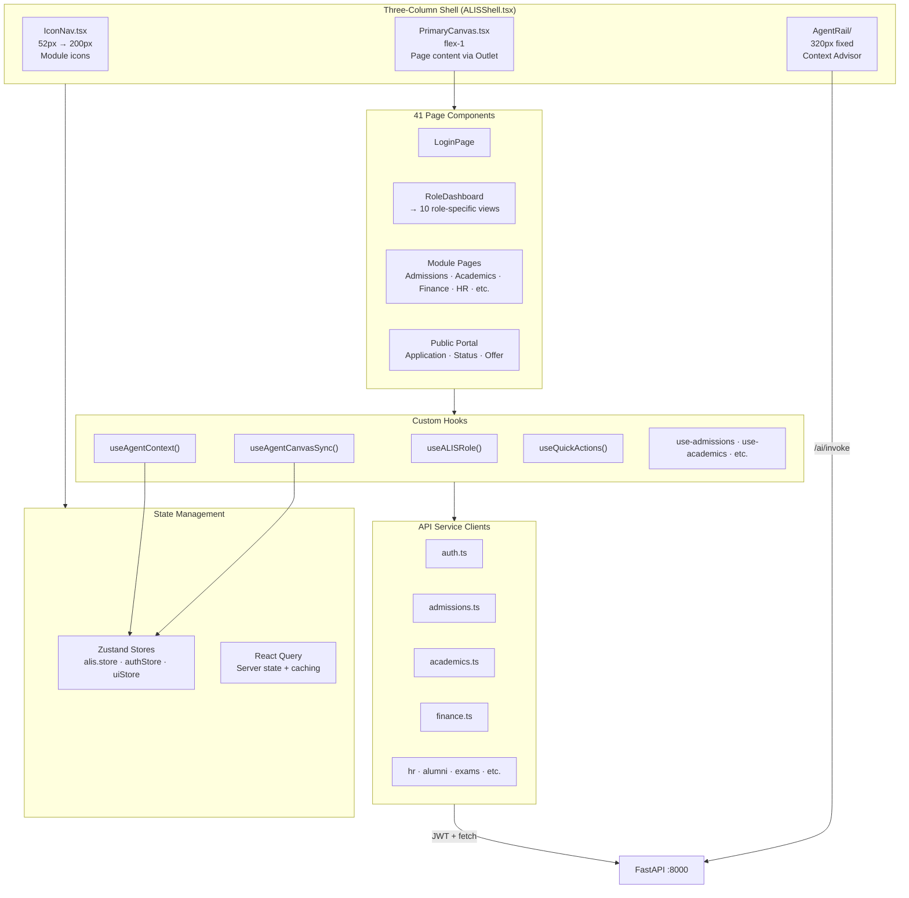

### 5.2 Entry Points & Configuration

| File | Purpose |
|------|---------|
| `index.html` | Root HTML shell. Preconnects Google Fonts (Syne, DM Sans, IBM Plex Mono). |
| `src/main.tsx` | React 19 entry point. Renders `<App />` inside `StrictMode`. Imports i18n + CSS. |
| `src/App.tsx` | Central router (React Router 7.1). Public routes (`/login`, `/apply/*`) + protected routes via `<ALISShell>`. 40+ route definitions. `QueryClientProvider` wraps everything. `ErrorBoundary` at top level. |
| `vite.config.ts` | Vite 6.2 config. React + Tailwind plugins. PWA (Workbox: cache-first for attendance, network-first for session API). Path alias `@` → `./src`. Proxy `/api` → `localhost:8000`. |
| `tsconfig.app.json` | TypeScript: ES2020 target, strict mode, `@/*` path alias. |
| `src/index.css` | Design system: ALIS Green (#1D9E75) accent, Syne/DM Sans/IBM Plex Mono typography, glassmorphism surfaces, custom animations. |

### 5.3 Shell Components

| File | Purpose |
|------|---------|
| `src/shell/ALISShell.tsx` | Three-column layout root. Desktop: 52px nav \| flex-1 canvas \| 320px agent. Mobile: full-canvas + FAB → bottom sheet (50vh). |
| `src/shell/IconNav.tsx` | Collapsible left sidebar (52px → 200px on hover/pin). Module icons from `useALISRole()`. Active module highlighting. |
| `src/shell/PrimaryCanvas.tsx` | Hosts `<Outlet />` for page content. Updates canvas store on route change. Wires `useAgentCanvasSync()` and `useAgentContext()`. |
| `src/shell/AgentRail/AgentRail.tsx` | Right sidebar container for "Context Advisor". |
| `src/shell/AgentRail/AgentHeader.tsx` | Rail header with controls. |
| `src/shell/AgentRail/ChatThread.tsx` | Message history (capped 50). |
| `src/shell/AgentRail/ChatInput.tsx` | User input textarea. |
| `src/shell/AgentRail/QuickActions.tsx` | Context-aware action chips (≤4) per view + role. |
| `src/shell/AgentBottomSheet.tsx` | Mobile: 50vh bottom sheet on FAB tap. |

### 5.4 Pages (41 Components)

| Category | Pages | Route |
|----------|-------|-------|
| **Auth** | `LoginPage` | `/login` |
| **Dashboard** | `RoleDashboard` → 10 views (Registrar, Faculty, Student, Finance, HOD, ExamController, HRManager, Dean, Admin, SuperAdmin) | `/dashboard` |
| **Admissions** | `AdmissionsPage`, `AdmissionsModulePage`, `ReadmissionPage`, `SeatMatrixPage` | `/admissions/*` |
| **Academics** | `AcademicsPage`, `OBEPage`, `LearningPage` | `/academics/*` |
| **Examinations** | `ExaminationsPage` | `/examinations` |
| **Finance** | `FinancePage`, `BudgetPage`, `VendorsPage` | `/finance`, `/budget`, `/vendors` |
| **HR** | `HRPage`, `RecruitmentPage`, `TrainingPage` | `/hr`, `/recruitment`, `/training` |
| **Student Self** | `MyCoursesPage`, `MyExamsPage`, `MyFeesPage`, `MyLibraryPage` | `/my/*` |
| **Admin** | `OnboardingWizardPage`, `PolicyStudioPage`, `TeamManagementPage` | `/admin/*` |
| **Public Portal** | `PortalHomePage`, `ApplicationWizardPage`, `ApplicationStatusPage`, `OfferLetterPage` | `/apply/*` |
| **Guardian** | `GuardianPortalPage` | `/guardian` |
| **Other** | `StudentServicesPage`, `CommunicationHubPage`, `AlumniPage`, `PhDPage`, `ConvocationPage`, `RegulatoryPage`, `ReportsPage`, `SettingsPage`, `WorkflowsPage`, `ProcessEnginePage`, `ConsentPage`, `ClubsEventsPage`, `OfflineAttendancePage` | Various |

### 5.5 Shared Components (20)

| Component | Purpose |
|-----------|---------|
| `DataTable.tsx` | High-density grid powered by TanStack Table |
| `StatCard.tsx` | Dashboard KPI card |
| `Badge.tsx` | Status badge (colored label) |
| `ApprovalRow.tsx` | Single approval queue item |
| `RiskBar.tsx` | Visual risk indicator |
| `SLABar.tsx` | SLA deadline progress bar |
| `PermissionPicker.tsx` | Role/permission selector |
| `CampusSwitcher.tsx` | Multi-campus selector |
| `RoleSwitch.tsx` | Role toggling for multi-role users |
| `UndoToast.tsx` | Toast notification with undo |
| `TAAssignmentPanel.tsx` | Teaching Assistant assignment UI |
| `TimelinePanel.tsx` | Activity timeline |
| `ErrorBoundary.tsx` | React error boundary |
| `layout/Header.tsx` | Top header bar |
| `layout/ChatPanel.tsx` | Agent rail chat panel |
| `ui/alis-tabs.tsx` | Custom Tabs |
| `ui/interfaces-progress.tsx` | Multi-step progress |
| `ui/morphing-text-reveal.tsx` | Animated text reveal |
| `ui/popover.tsx` | Popover tooltip |
| `ui/steps.tsx` | Stepper component |

### 5.6 Hooks

| Hook | Purpose |
|------|---------|
| `useALISRole.ts` | Maps backend role string → `ALISRole` enum + density, modules, default view |
| `useAgentContext.ts` | Fires proactive backend context query on view change |
| `useAgentCanvasSync.ts` | Syncs pending agent `CanvasAction`s to UI (navigate, highlight, filter) |
| `useQuickActions.ts` | Returns context-aware quick action chips per view + role |
| `use-admissions.ts` | React Query hooks: leads, applications, documents, eligibility, tests, interviews, merit, offers, payments, enrollment |
| `use-academics.ts` | Programs, courses, timetable, at-risk students, insights |
| `use-examinations.ts` | Exam schedules, analytics, AI insights, re-evaluation |
| `use-finance.ts` | Fee structures, scholarships, waivers, collection reports, default risk |
| `use-hr.ts` | Staff, leave, payroll, performance, attendance, analytics |
| `use-alumni.ts` | Profiles, placement stats, job board, drives, mentors |
| `use-communication.ts` | Templates, failed logs, announcements, bulk campaigns |
| `use-reporting.ts` | Generic reporting hooks |

### 5.7 Services (API Clients)

All services use JWT from `sessionStorage`, auto-inject auth header, handle 401 with token refresh.

| Service | Endpoint Count | Key APIs |
|---------|----------------|----------|
| `auth.ts` | 5+ | `login()`, `logout()`, `getMe()`, `apiFetch()` |
| `admissions.ts` | 50+ | `leadsApi`, `applicationsApi`, `documentsApi`, `eligibilityApi`, `testsApi`, `interviewsApi`, `meritApi`, `offersApi`, `paymentsApi`, `enrollmentApi` |
| `academics.ts` | 15+ | `programsApi`, `coursesApi`, `timetableApi`, `attendanceApi`, `academicsAnalyticsApi` |
| `examinations.ts` | 8+ | `examSchedulesApi`, `examAnalyticsApi`, `reevalApi` |
| `finance.ts` | 10+ | `feeStructuresApi`, `scholarshipsApi`, `waiversApi`, `financeReportsApi` |
| `hr.ts` | 10+ | `staffApi`, `leaveApi`, `payrollApi`, `performanceApi`, `hrAttendanceApi`, `hrAnalyticsApi` |
| `alumni.ts` | 10+ | `alumniProfilesApi`, `placementApi`, `jobBoardApi`, `drivesApi`, `mentorsApi` |
| `communication.ts` | 8+ | `templatesApi`, `logsApi`, `announcementsApi`, `bulkApi`, `commsStatsApi` |
| `learning.ts` | 10+ | Materials, assignments, submissions, AI generation |

### 5.8 Stores (Zustand)

| Store | State | Actions |
|-------|-------|---------|
| `alis.store.ts` (186 lines) | **canvas**: view, module, filters, highlightedItemId, selectedItemIds, scrollToItemId. **agent**: contextLabel, pendingAction, isTyping, quickActions, agentContext. **chat**: messages (capped 50). | `setCanvasView`, `highlightItem`, `dispatchAgentAction`, `addMessage`, `setQuickActions` |
| `authStore.ts` (43 lines) | user, isAuthenticated, token, isLoading | `setAuth`, `logout`, `hydrate` (from sessionStorage) |
| `uiStore.ts` (14 lines) | sidebarOpen | `setSidebarOpen`, `toggleSidebar` |

### 5.9 Lib (Utilities)

| File | Purpose |
|------|---------|
| `alis-api.ts` | Typed HTTP client (get/post/put/patch/delete). Base: `VITE_API_URL`. Auto-injects JWT. |
| `agent-gateway.ts` | Agent rail interface. `invokeRailAgent()` → POST `/ai/invoke`. PII stripping. Parses `AgentResponse`. |
| `canvas-actions.ts` | Type definitions: `ALISModule` (28 modules), `CanvasView`, `CanvasAction` (NAVIGATE/HIGHLIGHT/FILTER/OPEN_DETAIL/EXECUTE), `AgentResponse`. |
| `role-config.ts` | `ALISRole` enum (10 roles), `ROLE_DENSITY`, `ROLE_DEFAULT_VIEW`, `ROLE_MODULES`, `MODULE_ICONS`, `MODULE_LABELS`, `MODULE_ROUTES`. |
| `format.ts` | IST time formatting, Indian currency (lakh/crore grouping). |
| `utils.ts` | `cn()` — clsx + tailwind-merge utility. |
| `quick-actions.ts` | Context-aware action chips: view × role → string[] (≤4). |
| `queryClient.ts` | TanStack Query config: staleTime 2m, retry 1, no refetchOnWindowFocus. |

### 5.10 i18n (6 Languages)

| Language | Code | File |
|----------|------|------|
| English | en | `i18n/en.json` |
| Hindi | hi | `i18n/hi.json` |
| Telugu | te | `i18n/te.json` |
| Kannada | kn | `i18n/kn.json` |
| Tamil | ta | `i18n/ta.json` |
| Marathi | mr | `i18n/mr.json` |

Scope: Student/parent-facing strings only. Staff UI stays English.

---

## 6. SaaS Platform

### 6.1 Control Plane (S2) — `control_plane/`

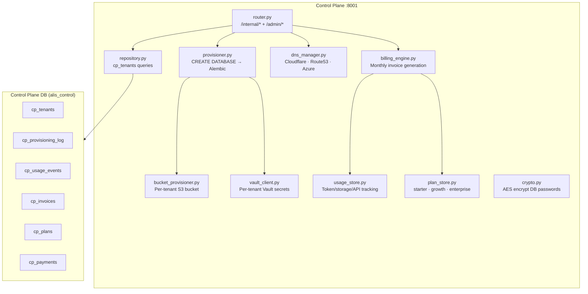

| File | Purpose | Key Exports |
|------|---------|-------------|
| `main.py` | FastAPI app for control plane. CORS, health probe, exception handling. | `app` |
| `router.py` | 24.6 KB. `/internal/*` (X-Internal-Token, data-plane calls), `/admin/*` (Bearer JWT, superadmin). | `GET /internal/tenants/{id}/db-config`, `POST /admin/tenants` |
| `settings.py` | Pydantic config: CP DB, admin DB (superuser for CREATE DATABASE), internal token, Vault, Cloudflare, Route53. | `CPSettings` |
| `db.py` | CP-specific schema tables + psycopg2 ThreadedConnectionPool (2–10). | `get_cp_pool()` |
| `provisioner.py` | Full tenant provisioning: CREATE DATABASE → CREATE ROLE → GRANT → Alembic `upgrade head`. | `provision_tenant()` |
| `billing_engine.py` | Monthly invoice computation. Reads usage events, computes line items. | `BillingEngine.generate_invoice()` |
| `billing_models.py` | Plan tiers: starter (100K tokens), growth (1M), enterprise (10M). | `Plan`, `Invoice`, `LineItem` |
| `usage_store.py` | Append to `cp_usage_events` (immutable). Compute period summaries. | `record_usage()`, `get_summary()` |
| `dns_manager.py` | Subdomain CNAME provisioning (Cloudflare/Route53/Azure). | `provision_dns()` |
| `bucket_provisioner.py` | Per-tenant S3/MinIO bucket creation + policy. | `provision_bucket()` |
| `vault_client.py` | Vault KV v2 per-tenant secrets. AppRole auth. | `VaultClient` |
| `plan_store.py` | CRUD for billing plans. | `PlanStore` |
| `repository.py` | Data access layer for cp_tenants. | `TenantRepository` |
| `crypto.py` | AES encryption for stored DB passwords. | `encrypt()`, `decrypt()` |
| `models.py` | Request/response schemas: `TenantProvisionRequest`, `TenantRecord`. | Pydantic models |

### 6.2 AI Service (S3) — `ai_service/`

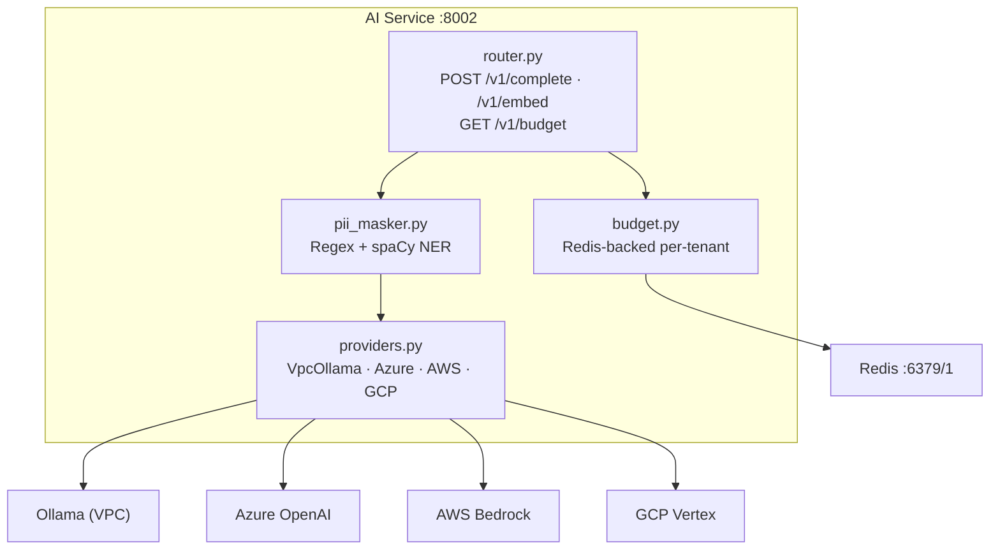

| File | Purpose | Key Exports |
|------|---------|-------------|
| `main.py` | FastAPI app for AI service. Health probe. | `app` |
| `router.py` | `POST /v1/complete` (inference + PII mask + budget), `POST /v1/embed`, `GET /v1/budget/{tenant_id}`. X-AI-Token auth. | Endpoints |
| `settings.py` | Tiered models: extraction (1.5B), generation (7B), reasoning (14B). Azure/AWS/GCP configs. PII masking toggle. Budget limits per plan. | `AISettings` |
| `models.py` | `CompleteRequest` (task_class: extraction/generation/reasoning), `CompleteResponse`, `EmbedRequest/Response`, `BudgetStatusResponse`. | Pydantic models |
| `providers.py` | `VpcOllamaProvider` (native HTTP), `AzureOpenAIProvider` (OpenAI SDK), `BedrockProvider` (boto3), `VertexProvider` (google-cloud). `ProviderRouter` selects by task_class + plan + feature_flags. | `ProviderRouter.route()` |
| `budget.py` | Redis key `alis:{tenant_id}:{YYYY-MM}` with TTL 45d. Check + increment atomic. | `check_budget()`, `increment_usage()` |
| `pii_masker.py` | Regex patterns for SSN, credit cards, emails, phones, Aadhaar. spaCy NER fallback. Reversible masking via session_id. | `PIIMasker.mask()`, `PIIMasker.unmask()` |

---

## 7. Infrastructure & DevOps

### 7.1 Kubernetes (Helm Charts + Operator)

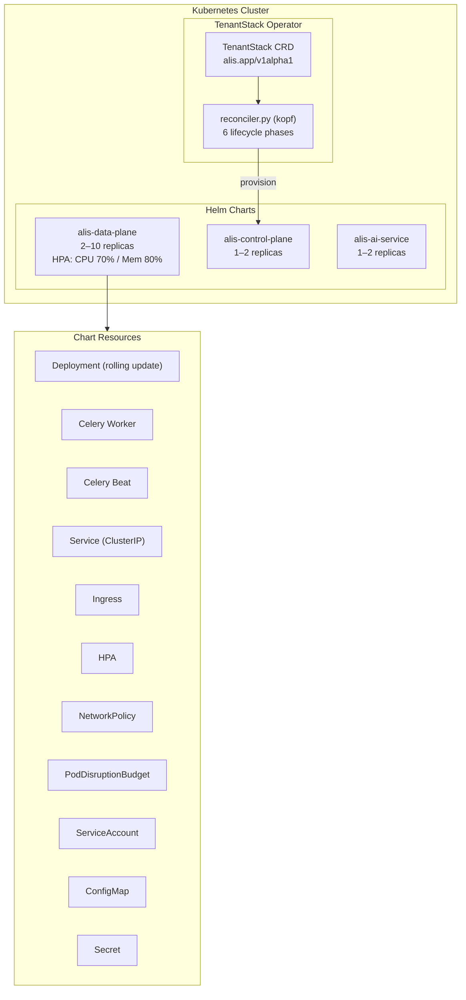

**TenantStack CRD** (Custom Resource Definition):
- Kind: `TenantStack`, Group: `alis.app`, Version: `v1alpha1`
- Spec: subdomain, displayName, plan (starter/growth/enterprise), region, featureFlags, database (optional BYOD), storage, suspended
- Status phases: `Pending → Provisioning → Active → Suspended → Deleting → Failed`
- Reconciler calls control plane API to provision DB, S3, Vault, DNS, queues

### 7.2 Terraform (Multi-Cloud)

| Module | Provider | Resources |
|--------|----------|-----------|
| `modules/aws/` | AWS | VPC (3 AZs), EKS cluster, RDS PostgreSQL (Multi-AZ), ElastiCache Redis, S3 bucket, Route53, KMS |
| `modules/azure/` | Azure | AKS cluster, Azure PostgreSQL (Flexible), Azure Cache Redis, Azure Storage |
| `modules/gcp/` | GCP | GKE cluster, Cloud SQL PostgreSQL, Memorystore Redis, GCS bucket |
| `modules/shared/` | — | Vault setup (KV v2, policies, AppRole auth) |
| `envs/dev/` | — | Dev environment root module |
| `envs/staging/` | — | Staging environment root module |
| `envs/prod/` | — | Production environment root module |

### 7.3 Monitoring Stack

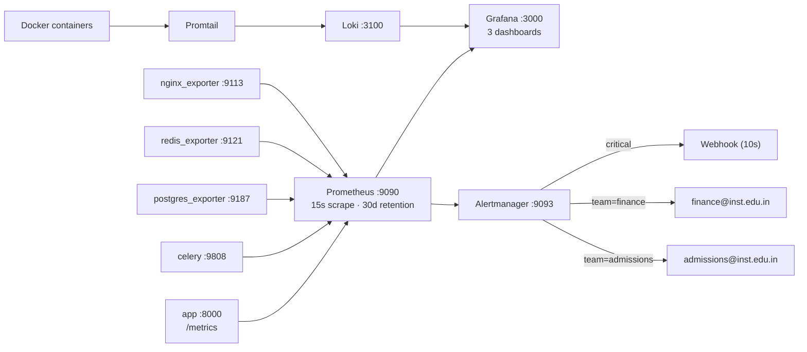

**Alert Rules:**
- `HighHTTPErrorRate`: 5xx rate > 5% for 2m → severity=critical
- `HighHTTPLatencyP95`: P95 > 500ms for 5m → severity=warning

**Grafana Dashboards:**
- `alis_operations.json` — Platform uptime, request rates, latency
- `alis_admissions.json` — Admissions module metrics
- `alis_domain_events.json` — Domain event throughput + errors

---

## 8. Database — Complete Schema

### 8.1 Schema Overview

```mermaid
erDiagram
    organisations ||--o{ users : "has"
    organisations ||--o{ programs : "offers"
    organisations ||--o{ applicants : "receives"
    organisations ||--o{ students : "enrolls"

    users ||--o{ role_assignments : "has"
    users ||--o{ staff_profiles : "is"
    users ||--o{ mfa_devices : "owns"

    programs ||--o{ courses : "contains"
    programs ||--o{ fee_structures : "has"
    programs ||--o{ program_outcomes : "defines"

    courses ||--o{ course_enrollments : "has"
    courses ||--o{ faculty_assignments : "assigned"
    courses ||--o{ exam_schedules : "scheduled"
    courses ||--o{ course_outcomes : "defines"
    courses ||--o{ timetable_slots : "has"
    courses ||--o{ attendance_sessions : "tracks"

    course_outcomes ||--o{ co_po_mapping : "maps"
    program_outcomes ||--o{ co_po_mapping : "maps"

    applicants ||--o{ application_documents : "uploads"
    applicants ||--o{ offer_letters : "receives"
    applicants ||--o{ admission_records : "confirmed"
    applicants ||--o{ students : "becomes"

    students ||--o{ course_enrollments : "enrolls"
    students ||--o{ grades : "earns"
    students ||--o{ semester_results : "accumulates"
    students ||--o{ hostel_allocations : "assigned"
    students ||--o{ transport_assignments : "uses"
    students ||--o{ student_invoices : "owes"
    students ||--o{ alumni_profiles : "graduates_to"

    exam_schedules ||--o{ grades : "produces"
    exam_schedules ||--o{ hall_tickets : "issues"

    student_invoices ||--o{ payments : "paid_by"
    student_invoices ||--o{ fee_waivers : "waived_by"

    staff_profiles ||--o{ leave_requests : "submits"
    staff_profiles ||--o{ payslips : "receives"
    staff_profiles ||--o{ performance_reviews : "reviewed"

    process_definitions ||--o{ process_steps : "has"
    process_definitions ||--o{ process_instances : "runs"
    process_instances ||--o{ process_step_logs : "logs"

    alumni_profiles ||--o{ alumni_connections : "connects"
    alumni_profiles ||--o{ mentorship_requests : "mentors"

    phd_registrations ||--o{ phd_milestones : "tracks"
    phd_registrations ||--o{ phd_dc_meetings : "meets"
    phd_registrations ||--o{ phd_thesis_submissions : "submits"

    convocation_events ||--o{ convocation_degree_audits : "audits"
    convocation_events ||--o{ convocation_seating : "seats"
```

### 8.2 Table Count by Module

| Module | Tables | Key Tables |
|--------|--------|------------|
| **Core / Auth** | 11 | users, organisations, organizations, roles, custom_roles, role_assignments, audit_ledger, domain_events, idempotency_store, org_api_keys, search_index |
| **Admissions** | 15+ | applicants, application_documents, counsellor_assignments, counsellor_embeddings, offer_letters, admission_records, students, seat_matrix, review_items, readmission_applications, credit_transfer_requests, reporting_gate_log |
| **Academics** | 12 | programs, courses, course_enrollments, faculty_assignments, timetable_slots, attendance_sessions, attendance_records, program_outcomes, course_outcomes, co_po_mapping, assessment_rubrics, attainment_records |
| **Examinations** | 7 | exam_schedules, hall_tickets, grades, semester_results, transcripts, reeval_requests, answer_evaluation_records |
| **Finance** | 10 | fee_structures, student_invoices, payments, payment_webhook_log, scholarships, scholarship_assignments, fee_waivers, student_fee_exemptions, fee_payment_components, payment_utr_disputes |
| **HR** | 8 | staff_profiles, leave_types, leave_requests, payroll_components, staff_salary_structures, payslips, performance_reviews, staff_attendance |
| **Student Services** | 11 | hostel_blocks, hostel_rooms, hostel_allocations, hostel_complaints, hostel_swap_requests, library_books, library_borrowings, transport_routes, transport_assignments, counselling_sessions, counselling_referrals |
| **Communication** | 7 | notification_templates, notification_logs, in_app_notifications, announcements, announcement_reads, bulk_message_jobs, whatsapp_delivery_log |
| **Reporting** | 3 | saved_reports, export_jobs, kpi_snapshots |
| **Alumni** | 8 | alumni_profiles, placement_records, job_postings, job_applications, recruitment_drives, drive_registrations, alumni_connections, mentorship_requests |
| **Process Engine** | 5 | process_definitions, process_steps, process_instances, process_step_logs, process_form_submissions |
| **Workflows** | 3 | workflows, approval_requests, approval_actions |
| **Regulatory** | 4 | regulatory_metrics, naac_evidence, nirf_data, aishe_data |
| **Consent (DPDP)** | 2 | consent_records, erasure_requests |
| **MFA** | 2 | mfa_devices, trusted_devices |
| **PhD** | 5 | phd_registrations, phd_milestones, phd_dc_meetings, phd_plagiarism_reports, phd_thesis_submissions |
| **Convocation** | 4 | convocation_events, convocation_degree_audits, convocation_seating, gold_medal_computations |
| **Multi-Campus** | 2 | campus_entities, campus_user_assignments |
| **Pilot / Hardening** | 8 | shadow_mode_divergence_log, shadow_mode_go_live_log, data_migration_jobs, data_migration_errors, outbound_webhook_subscriptions, outbound_webhook_deliveries, grievance_anomaly_log, course_recalibration_log |
| **Platform** | 5 | academic_calendars, calendar_phases, institution_policies, policy_registry, tenant_feature_flags |
| **TOTAL** | **~130+** | |

### 8.3 Row-Level Security (RLS)

All major tables have RLS enabled with tenant isolation:

```sql
CREATE POLICY {table}_tenant_isolation ON {table}
USING (org_id::text = current_setting('alis.current_tenant', TRUE))
```

**Special cases:**
- `audit_ledger`: SELECT + INSERT only (no UPDATE/DELETE) — immutability enforced
- Announcement reads, migration errors: Inherit isolation via parent FK

### 8.4 Key Constraints & Triggers

| Type | Example | Purpose |
|------|---------|---------|
| **Generated column** | `balance = amount_due - amount_paid - discount` on `student_invoices` | Auto-computed balance |
| **Trigger** | `fn_lock_fee_structure_on_invoice()` | Lock fee structure after first invoice created |
| **Trigger** | `decrement_seat_counter()` | Update seat_matrix on enrollment |
| **Trigger** | Immutability on `audit_ledger` | Block UPDATE/DELETE/TRUNCATE |
| **UNIQUE** | `(org_id, code)` on programs, courses | Natural key uniqueness |
| **CHECK** | Status enums, degree types, role scopes | Data integrity |
| **CASCADE DELETE** | `process_step_logs` → `process_instances` | Auto-cleanup child records |

### 8.5 PostgreSQL Extensions

| Extension | Purpose |
|-----------|---------|
| `uuid-ossp` | `gen_random_uuid()` for ID generation |
| `pgvector` | `vector(768)` type for counsellor profile embeddings |
| `pg_trgm` | Trigram text search (GIN indexes on names/titles) |
| TSVECTOR/GIN | Full-text search on `search_index` |

---

## 9. AI & Agent Architecture

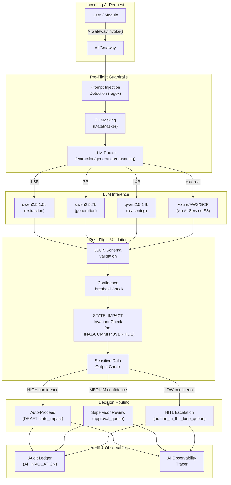

### AI Models Used

| Model | Provider | Tier | Use Cases |
|-------|----------|------|-----------|
| `qwen2.5:1.5b-instruct-q8_0` | Ollama (local) | Extraction | Data extraction, parsing, classification |
| `qwen2.5:7b-instruct` | Ollama (local) | Generation | Text generation, template filling |
| `qwen2.5:14b-instruct` | Ollama (local) | Reasoning | Complex decision-making, analysis |
| `nomic-embed-text` | Ollama (local) | Embedding | PGVector search, counsellor matching, RAG |
| GPT-4o | Azure OpenAI | External | Enterprise tier via AI Service S3 |
| Amazon Nova | AWS Bedrock | External | Enterprise tier via AI Service S3 |
| Gemini 1.5 | GCP Vertex | External | Enterprise tier via AI Service S3 |

### AI Invariant: "AI proposes, rules enforce"

1. AI agents can ONLY output `DRAFT` or `PROVISIONAL` state_impact
2. AI cannot call mutation endpoints
3. AI cannot bypass state machine transitions
4. AI cannot override global locks
5. All AI decisions require confidence scoring
6. Low-confidence decisions escalate to HITL queue
7. All invocations logged to immutable audit ledger

---

## 10. Domain Event Flows

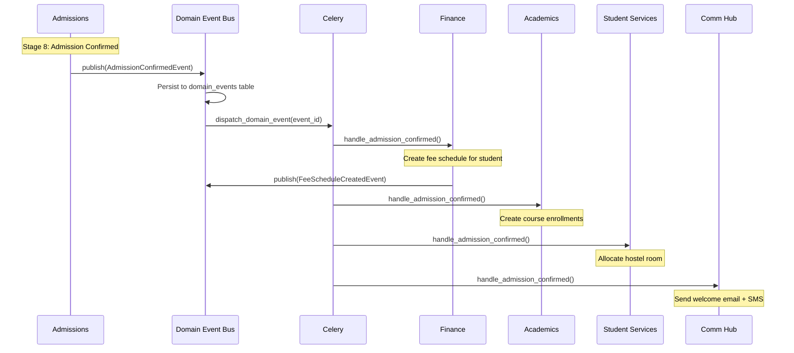

### Key Event Types

| Event | Publisher | Subscribers |
|-------|-----------|-------------|
| `LeadCreatedEvent` | Admissions | Communication (welcome SMS) |
| `ApplicationSubmittedEvent` | Admissions | Communication (confirmation email), Finance (application fee) |
| `DocumentUploadedEvent` | Admissions | AI Tasks (verification), Communication (receipt) |
| `EligibilityEvaluatedEvent` | Admissions | Communication (result notification) |
| `MeritListPublishedEvent` | Admissions | Communication (merit notification) |
| `OfferIssuedEvent` | Admissions | Communication (offer email), Finance (fee demand) |
| `AdmissionConfirmedEvent` | Admissions | Finance, Academics, Student Services, Communication |
| `StudentEnrolledEvent` | Admissions | Academics (enrollments), Finance (fee schedule), HR (workload) |
| `CourseCompletedEvent` | Academics | Examinations (grade finalization) |
| `ResultPublishedEvent` | Examinations | Finance (grade card fee), Communication (result SMS) |
| `PaymentReceivedEvent` | Finance | Admissions (unlock next stage), Communication (receipt) |
| `LeaveApprovedEvent` | HR | Academics (substitute assignment) |
| `GrievanceEscalatedEvent` | Student Services | Communication (escalation email), Approvals |

---

## 11. Dependencies & Libraries

### 11.1 Backend (Python) — 39 Packages

| Category | Package | Version | Role |
|----------|---------|---------|------|
| **Web** | fastapi | 0.115.0 | REST API framework with auto OpenAPI docs |
| | uvicorn[standard] | 0.30.6 | ASGI server (uvloop + httptools) |
| | python-multipart | 0.0.9 | File upload / form-data parsing |
| **Validation** | pydantic | ≥2.9,<3.0 | Request/response model validation |
| | pydantic-settings | ≥2.4.0 | Environment variable configuration |
| **Database** | psycopg2-binary | 2.9.9 | Synchronous PostgreSQL driver |
| | asyncpg | 0.29.0 | Async PostgreSQL driver (FastAPI handlers) |
| | alembic | 1.13.2 | Schema migration management |
| | sqlalchemy | 2.0.35 | ORM (used by Alembic only) |
| **Tasks** | celery[redis] | 5.4.0 | Distributed task queue |
| | redis | 5.0.8 | Broker, cache, sessions, rate limiting |
| **AI/LLM** | langgraph | 1.1.2 | Graph-based AI agent orchestration |
| | langchain-core | ≥1.2.18,<2.0 | LLM chain abstractions |
| | langchain-ollama | 0.3.10 | Ollama LLM wrapper |
| | langchain-openai | 1.1.11 | OpenAI-compatible API wrapper |
| | openai | 2.28.0 | OpenAI Python SDK |
| | httpx | 0.27.2 | Async HTTP client (Ollama + testing) |
| **Storage** | minio | 7.2.8 | S3-compatible object storage client |
| **Documents** | reportlab | 4.2.2 | PDF generation (offer letters, hall tickets) |
| | openpyxl | 3.1.5 | Excel export (.xlsx) |
| **Payments** | razorpay | 1.4.1 | Razorpay payment gateway |
| **Security** | bcrypt | 4.2.0 | Password hashing |
| | PyJWT | 2.9.0 | JWT token signing/verification |
| | pyotp | 2.9.0 | TOTP MFA generation |
| | cryptography | 43.0.1 | Fernet encryption (TOTP secrets at rest) |
| | hvac | 2.3.0 | HashiCorp Vault client |
| **Observability** | prometheus-client | 0.21.0 | Metrics exposition |
| | sentry-sdk[fastapi] | 2.14.0 | Error tracking + APM |
| **Utilities** | python-dateutil | 2.9.0 | Extended date/time utilities |
| | orjson | 3.10.7 | Fast JSON serialization (C-based) |
| | asteval | 1.0.2 | Safe expression evaluator (policy DSL) |
| **Testing** | pytest | 8.3.2 | Test framework |
| | pytest-asyncio | 0.23.8 | Async test support |
| | pytest-cov | 5.0.0 | Coverage reporting |
| | fakeredis | 2.34.1 | In-memory Redis mock |

### 11.2 Frontend (TypeScript/React) — 40+ Packages

| Category | Package | Version | Role |
|----------|---------|---------|------|
| **Core** | react | ^19.0.0 | UI library |
| | react-dom | ^19.0.0 | DOM rendering |
| | react-router-dom | ^7.1.1 | Client-side routing |
| **State** | zustand | ^5.0.2 | Lightweight global state (canvas, auth, UI) |
| | @tanstack/react-query | ^5.62.3 | Server state + caching (staleTime 2m) |
| **UI Components** | @radix-ui/react-* | Various | 12 headless accessible primitives (dialog, dropdown, tabs, tooltip, etc.) |
| | @ark-ui/react | ^5.35.0 | Additional headless components |
| | @base-ui/react | ^1.3.0 | Base unstyled components |
| **Data** | @tanstack/react-table | ^8.21.3 | Headless data tables |
| | dexie | ^4.3.0 | IndexedDB wrapper (offline storage) |
| | zod | ^3.24.1 | Runtime schema validation |
| **Styling** | tailwindcss | ^4.0.0 | Utility-first CSS |
| | @tailwindcss/vite | ^4.0.0 | Vite integration |
| | class-variance-authority | ^0.7.1 | Type-safe CSS class composition |
| | clsx | ^2.1.1 | Conditional className concatenation |
| | tailwind-merge | ^2.5.5 | Intelligent class merging |
| **Icons** | lucide-react | ^0.468.0 | Icon library |
| **Animation** | framer-motion | ^11.12.0 | Gestures and transitions |
| | motion | ^12.38.0 | Modern animation library |
| **DnD** | @dnd-kit/* | Various | Drag-and-drop (core, modifiers, sortable, utilities) |
| **i18n** | i18next | ^25.8.19 | Internationalization framework |
| | react-i18next | ^16.5.8 | React bindings for i18next |
| **PWA** | vite-plugin-pwa | ^1.2.0 | Offline capability (attendance marking) |
| **Build** | vite | ^6.2.0 | Build tool + dev server |
| | typescript | ~5.7.2 | Type safety |
| | eslint | ^9.17.0 | Code linting |

### 11.3 Control Plane — 8 Packages

fastapi, pydantic-settings, psycopg2-binary, cryptography, PyJWT[cryptography], boto3, httpx, uvicorn[standard]

### 11.4 AI Service — 6 Packages

fastapi, pydantic-settings, httpx, redis, celery[redis], uvicorn[standard]
Optional: openai, boto3, google-cloud-aiplatform, spacy

---

## 12. Security Architecture

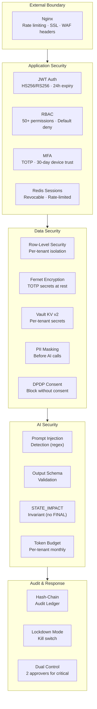

### Authentication Flow

1. `POST /api/v1/auth/login` → bcrypt verify → create Redis session → return JWT
2. If MFA required: return `mfa_challenge_token` → user provides TOTP code → verify → issue full JWT
3. JWT in `Authorization: Bearer <token>` header on all subsequent requests
4. Session auto-expires after 24h. Refresh via `/auth/refresh`.
5. Failed logins tracked in Redis. Account lockout after configurable max attempts.

### Redis Key Design

| Prefix | TTL | Purpose |
|--------|-----|---------|
| `alis:sess:{session_id}` | 24h | Session data |
| `alis:tok:{token_hash}` | 24h | Token → session mapping |
| `alis:user_sess:{user_id}` | 24h | User → session set |
| `alis:fail:{user_id}` | 15m | Failed login counter |
| `alis:lockout:{user_id}` | 30m | Account lockout flag |
| `alis:rate:{key}` | 1m | Rate limiting counter |
| `alis:pwreset:{token}` | 1h | Password reset token |
| `alis:gotp:{guardian_id}` | 5m | Guardian OTP |
| `alis:{tenant_id}:{YYYY-MM}` | 45d | AI token budget (AI Service) |

---

## 13. Deployment & CI/CD

### 13.1 CI Pipeline (`.github/workflows/ci.yml`)

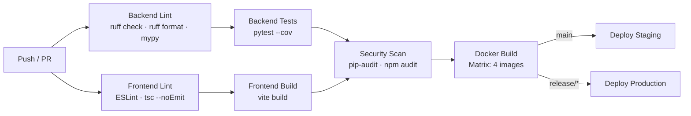

**Images built and pushed to GHCR:**
1. `ghcr.io/{org}/alis` — Data plane
2. `ghcr.io/{org}/alis-control-plane` — Control plane
3. `ghcr.io/{org}/alis-ai-service` — AI service
4. `ghcr.io/{org}/alis-web` — Frontend (Nginx + static)

### 13.2 PR Quality Gate (`.github/workflows/pr-quality-gate.yml`)

| Check | Threshold | Action |
|-------|-----------|--------|
| Size check | > 50 files changed | Warning comment |
| Secret scan | Regex for password/api_key/secret patterns | Warning (non-blocking) |
| Migration check | Duplicate revision numbers | Fail |

### 13.3 Local Development Quick Start

```bash
# 1. Start infrastructure
docker-compose up -d postgres redis minio vault ollama

# 2. Run migrations
cd ALIS && alembic upgrade head

# 3. Seed data
python scripts/seed.py

# 4. Start backend
uvicorn server.main:app --reload --port 8000

# 5. Start Celery worker
celery -A server.worker worker --loglevel=info -Q default,ai_tasks,notifications

# 6. Start frontend
cd web && npm install && npm run dev
```

### 13.4 Environment Variables (Key Categories)

| Category | Variables | Source |
|----------|-----------|--------|
| **Application** | `APP_ENV`, `APP_SECRET_KEY`, `APP_DEBUG`, `ALLOWED_ORIGINS` | .env |
| **Database** | `DB_HOST`, `DB_PORT`, `DB_USER`, `DB_PASSWORD`, `DB_NAME` | .env / Vault |
| **Redis** | `REDIS_URL` | .env |
| **JWT** | `JWT_SECRET_KEY`, `JWT_ALGORITHM` | .env / Vault |
| **MinIO** | `MINIO_ENDPOINT`, `MINIO_ACCESS_KEY`, `MINIO_SECRET_KEY`, `MINIO_BUCKET` | .env / Vault |
| **Ollama** | `OLLAMA_BASE_URL`, `OLLAMA_MODEL_*` | .env |
| **MFA** | `MFA_REQUIRED_ROLES`, `MFA_TOKEN_LIFETIME` | .env |
| **SMTP** | `SMTP_HOST`, `SMTP_PORT`, `SMTP_USER`, `SMTP_PASSWORD` | .env / Vault |
| **SMS** | `SMS_PROVIDER`, `SMS_API_KEY` | Vault |
| **Vault** | `VAULT_ADDR`, `VAULT_TOKEN` / `VAULT_ROLE_ID` + `VAULT_SECRET_ID` | .env |
| **SaaS** | `CONTROL_PLANE_URL`, `INTERNAL_TOKEN`, `AI_SERVICE_URL`, `AI_SERVICE_TOKEN` | .env |
| **Payments** | `RAZORPAY_KEY_ID`, `RAZORPAY_KEY_SECRET`, `STRIPE_SECRET_KEY` | Vault |

---

## Appendix: Complete File Tree

```
ALIS Production/
├── ALIS/                              # Backend (FastAPI + Python)
│   ├── Dockerfile                     # Multi-stage build, non-root user
│   ├── alembic.ini                    # Migration configuration
│   ├── requirements.txt               # 39 Python dependencies
│   ├── pytest.ini                     # Test configuration
│   ├── migrations/
│   │   ├── env.py                     # Alembic environment
│   │   └── versions/                  # 41 migration files (0001–0041)
│   ├── scripts/
│   │   ├── seed.py                    # Bootstrap org, admin, policies
│   │   ├── onboard_institution.py     # CLI tenant provisioning
│   │   ├── verifier.py               # Data integrity checks
│   │   └── install_ollama.sh          # Ollama setup script
│   ├── server/
│   │   ├── main.py                    # FastAPI app factory (29 routers, 7 middleware)
│   │   ├── db_service.py              # Tenant-aware DB layer
│   │   ├── worker.py                  # Celery app + DLQ
│   │   ├── fs_service.py              # MinIO file storage
│   │   ├── core/                      # 56 infrastructure files
│   │   │   ├── settings.py            # Pydantic Settings
│   │   │   ├── security.py            # Auth, sessions, passwords
│   │   │   ├── audit.py               # Hash-chain audit ledger
│   │   │   ├── domain_events.py       # DB-backed event bus
│   │   │   ├── events.py              # In-process event bus
│   │   │   ├── rbac.py                # Roles + permissions
│   │   │   ├── models.py              # User, Organization entities
│   │   │   ├── state_registry.py      # State machine validation
│   │   │   ├── locks.py               # Global invariant locks
│   │   │   ├── ai_gateway.py          # AI single entry point
│   │   │   ├── guardrails.py          # AI output validation
│   │   │   ├── hitl.py                # Human-in-the-loop
│   │   │   ├── ai_observability.py    # AI execution tracing
│   │   │   ├── ai_providers.py        # Ollama/OpenAI abstraction
│   │   │   ├── llm_router.py          # Tiered model selection
│   │   │   ├── prompt_registry.py     # Version-controlled prompts
│   │   │   ├── model_registry.py      # Model metadata
│   │   │   ├── tool_registry.py       # AI tool definitions
│   │   │   ├── approvals.py           # Multi-approver workflow
│   │   │   ├── workflow.py            # Abstract workflow base
│   │   │   ├── policy_engine.py       # Safe expression evaluator
│   │   │   ├── policy_service.py      # Policy lifecycle
│   │   │   ├── data_classification.py # Sensitivity levels
│   │   │   ├── diff_tracker.py        # Field-level changes
│   │   │   ├── retention_policy.py    # Data lifecycle
│   │   │   ├── mfa_service.py         # TOTP MFA
│   │   │   ├── escalation.py          # Privilege elevation
│   │   │   ├── overrides.py           # Policy exceptions
│   │   │   ├── lockdown.py            # Incident response
│   │   │   ├── vault_client.py        # Vault integration
│   │   │   ├── tenant_registry.py     # Multi-tenant config
│   │   │   ├── tenant_crypto.py       # Per-tenant encryption
│   │   │   ├── feature_flags.py       # Feature toggles
│   │   │   ├── config.py              # Business policy registry
│   │   │   ├── webhook_dispatcher.py  # Outbound webhooks
│   │   │   ├── backup_service.py      # Database backups
│   │   │   ├── metrics.py             # Prometheus metrics
│   │   │   ├── exceptions.py          # Exception hierarchy
│   │   │   ├── error_handlers.py      # Global error handlers
│   │   │   ├── notifications/         # Email, SMS, WhatsApp
│   │   │   └── documents/             # PDF generation
│   │   ├── api/                       # 29 API routers
│   │   │   ├── auth_router.py
│   │   │   ├── users_router.py
│   │   │   ├── admissions_router.py   # 87 endpoints
│   │   │   ├── academics_router.py
│   │   │   ├── examinations_router.py
│   │   │   ├── finance_router.py
│   │   │   ├── hr_router.py
│   │   │   ├── student_services_router.py
│   │   │   ├── communication_router.py
│   │   │   ├── reporting_router.py
│   │   │   ├── alumni_router.py
│   │   │   ├── process_engine_router.py
│   │   │   ├── learning_router.py     # 17 LMS endpoints
│   │   │   ├── phd_router.py
│   │   │   ├── convocation_router.py
│   │   │   ├── regulatory_router.py
│   │   │   ├── consent_router.py
│   │   │   └── ... (12 more routers)
│   │   ├── admissions/                # 39 files, 10-stage pipeline
│   │   │   ├── models.py
│   │   │   ├── lead_service.py
│   │   │   ├── application_form.py
│   │   │   ├── document_verification.py
│   │   │   ├── eligibility_service.py
│   │   │   ├── entrance_test.py
│   │   │   ├── interview.py
│   │   │   ├── merit_list.py
│   │   │   ├── offer_letter.py
│   │   │   ├── final_verification.py
│   │   │   ├── enrollment_provisioning.py
│   │   │   ├── event_handlers.py
│   │   │   └── integrations/          # DigiLocker, NTA, Razorpay
│   │   ├── academics/
│   │   │   ├── programs.py
│   │   │   ├── obe_service.py
│   │   │   ├── learning_service.py    # In-house LMS (P40)
│   │   │   └── ta_assignment_service.py
│   │   ├── examinations/
│   │   │   └── reeval.py
│   │   ├── finance/
│   │   │   ├── einvoice_service.py
│   │   │   └── tally_export.py
│   │   ├── hr/
│   │   │   ├── staff.py
│   │   │   └── performance.py
│   │   ├── student_services/
│   │   │   ├── transport.py
│   │   │   ├── counselling.py
│   │   │   └── event_handlers.py
│   │   ├── communication/
│   │   │   ├── notif_templates.py
│   │   │   └── whatsapp_service.py
│   │   ├── alumni/
│   │   │   └── profiles.py
│   │   ├── process_engine/
│   │   │   ├── definition.py
│   │   │   ├── executor.py
│   │   │   └── instance.py
│   │   ├── agents/                    # AI agents
│   │   │   └── academics/
│   │   │       └── content_generator_v1.py
│   │   └── tasks/                     # 12 Celery task modules
│   │       ├── notifications.py
│   │       ├── ai_tasks.py
│   │       ├── events.py
│   │       ├── calendar.py
│   │       ├── admissions.py
│   │       ├── finance.py
│   │       ├── reporting.py
│   │       ├── shadow_divergence.py
│   │       ├── webhook_retry.py
│   │       ├── backup.py
│   │       ├── plagiarism_poll.py
│   │       └── learning_tasks.py
│   └── tests/                         # 883+ unit tests
│       ├── conftest.py
│       └── test_*.py (20+ files)
│
├── web/                               # Frontend (React 19 + TypeScript)
│   ├── package.json                   # 40+ dependencies
│   ├── vite.config.ts                 # Vite 6.2 + PWA + Tailwind
│   ├── index.html
│   └── src/
│       ├── App.tsx                    # Central router (40+ routes)
│       ├── main.tsx                   # Entry point
│       ├── index.css                  # Design system (ALIS Green)
│       ├── shell/                     # Three-column layout
│       │   ├── ALISShell.tsx
│       │   ├── IconNav.tsx
│       │   ├── PrimaryCanvas.tsx
│       │   └── AgentRail/             # AI advisor sidebar
│       ├── pages/                     # 41 page components
│       ├── components/                # 20 shared components
│       ├── hooks/                     # Custom React hooks
│       ├── services/                  # API clients
│       ├── store/                     # Zustand stores
│       ├── lib/                       # Utilities & config
│       ├── types/                     # TypeScript interfaces
│       ├── views/                     # Role-specific dashboards
│       └── i18n/                      # 6 languages
│
├── control_plane/                     # S2 — SaaS Tenant Lifecycle
│   ├── Dockerfile
│   ├── requirements.txt
│   ├── main.py
│   ├── router.py                      # /internal/* + /admin/*
│   ├── settings.py
│   ├── db.py                          # cp_tenants schema
│   ├── provisioner.py                 # CREATE DATABASE + Alembic
│   ├── billing_engine.py              # Monthly invoicing
│   ├── dns_manager.py                 # Cloudflare/Route53/Azure
│   ├── bucket_provisioner.py          # Per-tenant S3
│   ├── vault_client.py                # Per-tenant Vault
│   └── tests/                         # 172 SaaS tests
│
├── ai_service/                        # S3 — Centralized AI Inference
│   ├── Dockerfile
│   ├── requirements.txt
│   ├── main.py
│   ├── router.py                      # /v1/complete, /v1/embed, /v1/budget
│   ├── providers.py                   # VpcOllama, Azure, AWS, GCP
│   ├── pii_masker.py                  # Regex + spaCy NER
│   ├── budget.py                      # Redis-backed token budget
│   └── tests/
│
├── docker-compose.yml                 # 17 services orchestrated
├── nginx/
│   └── nginx.conf                     # Rate limiting + SSL
│
├── infra/
│   ├── k8s/
│   │   ├── helm/                      # 3 Helm charts
│   │   │   ├── alis-data-plane/
│   │   │   ├── alis-control-plane/
│   │   │   └── alis-ai-service/
│   │   └── operator/                  # TenantStack CRD + kopf reconciler
│   ├── terraform/
│   │   ├── modules/aws/               # VPC, EKS, RDS, ElastiCache, S3
│   │   ├── modules/azure/             # AKS, PostgreSQL, Redis, Storage
│   │   ├── modules/gcp/               # GKE, Cloud SQL, Memorystore, GCS
│   │   ├── modules/shared/            # Vault setup
│   │   └── envs/{dev,staging,prod}/   # Per-environment config
│   ├── monitoring/
│   │   ├── prometheus.yml
│   │   ├── alertmanager.yml
│   │   ├── loki-config.yml
│   │   ├── rules/alis_alerts.yml
│   │   └── grafana/provisioning/      # Dashboards + datasources
│   └── vault/
│       └── vault-autostart.sh
│
├── .github/workflows/
│   ├── ci.yml                         # Lint → Test → Security → Docker → Deploy
│   └── pr-quality-gate.yml            # Size, secrets, migration checks
│
├── scripts/
│   ├── lint_alis.py
│   └── load_mockdata.py
│
├── .agents/skills/                    # 23 Claude Code skills
├── .env.example                       # Environment variable template
└── README.md                          # Project documentation
```

---

## 14. Performance Optimization Layer

ALIS enforces governance through a 6-layer deterministic pipeline. Optimization cannot bypass layers, weaken audit, decentralize AI authority, or remove DB-backed guarantees. Instead, the strategy is:

> **Make enforcement cheap, parallel, and off the critical path — without changing who enforces what.**

### 14.1 Optimized Request Flow

```mermaid
graph TB
    subgraph Before["BEFORE (Serial — ~80-150ms)"]
        B1["Request"] --> B2["7 Middleware (serial)"]
        B2 --> B3["RBAC"]
        B3 --> B4["Policy Engine"]
        B4 --> B5["Global Locks"]
        B5 --> B6["DB Transaction"]
        B6 --> B7["Audit (sync DB write)"]
        B7 --> B8["Domain Event (DB + Celery)"]
        B8 --> B9["Response"]
    end

    subgraph After["AFTER (Parallel + Async — ~30-60ms)"]
        A1["Request"] --> A2["6 Middleware<br/>(reordered: cheap first,<br/>probes short-circuit)"]
        A2 --> A3["Lockdown Pre-Check<br/>(in-memory, <1ms)"]
        A3 --> A4["RBAC Check<br/>(in-memory dict, <1ms)"]
        A4 --> A5["DB Transaction<br/>(state + RLS)"]
        A5 --> A6["Audit → Redis LPUSH<br/>(<1ms, async drain)"]
        A5 --> A7["Event → DB INSERT only<br/>(no Celery in request)"]
        A6 --> A8["Response"]
        A7 --> A8
    end

    style Before fill:#fff3e0
    style After fill:#e8f5e9
```

### 14.2 Architecture — Performance Components

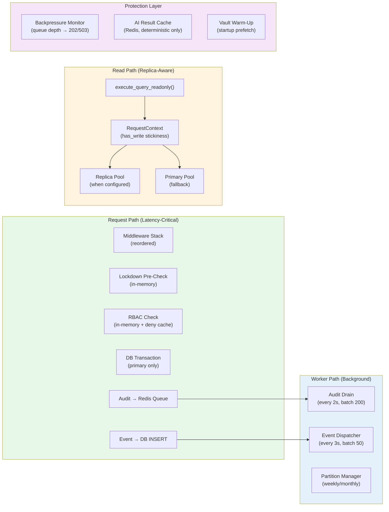

### 14.3 File Inventory — Performance Layer

| File | Purpose | Status |
|------|---------|--------|
| `server/core/perf.py` | Core optimization primitives: `ParallelPreChecks`, `AsyncAuditWriter`, `RedisCache`, `AIResultCache`, `DeferredEventPublisher`, `warm_vault_cache()`, `is_lightweight_request()` | Active |
| `server/core/request_context.py` | Request-scoped `RequestContext` ContextVar: `tenant_id`, `has_write`, `last_write_at`, `consistency_mode`, `should_use_replica()` | Active |
| `server/core/backpressure.py` | `BackpressureMonitor` — reads Celery queue depth from Redis (1s TTL cache). `QueuePolicy` per queue. FastAPI `Depends()` functions for targeted routes. | Active |
| `server/tasks/perf_tasks.py` | `drain_audit_queue` (every 2s), `dispatch_pending_events` (every 3s) | Active |
| `server/tasks/partition_mgmt.py` | `create_future_partitions` (weekly), `drop_expired_event_partitions` (weekly, 30d retention), `detach_old_audit_partitions` (monthly, 2yr retention) | Active |
| `migrations/versions/0046_table_partitioning.py` | Converts `audit_ledger` → monthly range partitions, `domain_events` → weekly range partitions | Migration |

### 14.4 Read/Write Splitting — Smart Routing

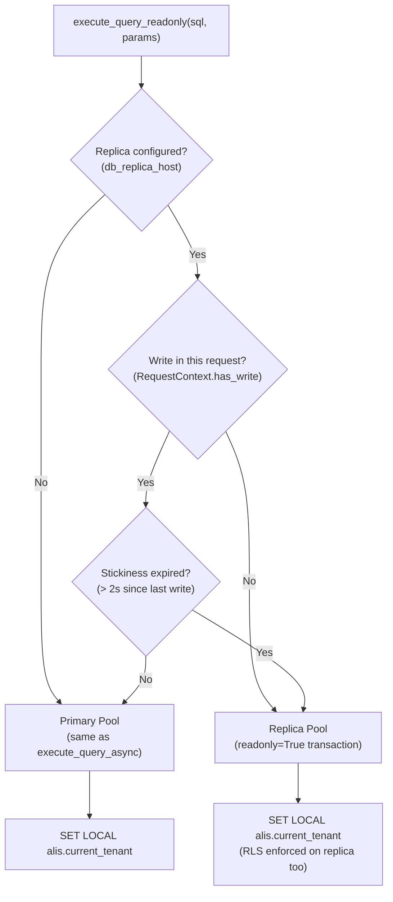

**Configuration** (`settings.py`):

| Setting | Default | Description |
|---------|---------|-------------|
| `db_replica_host` | `""` (disabled) | Read replica hostname. Empty = all reads go to primary. |
| `db_replica_port` | `5432` | Replica port |
| `db_replica_pool_min` | `2` | Min connections in replica pool |
| `db_replica_pool_max` | `20` | Max connections in replica pool |
| `db_read_after_write_stickiness_seconds` | `2.0` | After a write, reads stay on primary for this duration |

**Usage pattern:**
```python
# Dashboard aggregation — safe for replica
students = await execute_query_readonly(
    "SELECT count(*) FROM students WHERE org_id = %s", (org_id,)
)

# State transition validation — MUST use primary
current_state = await execute_query_async(
    "SELECT status FROM applicants WHERE id = %s", (applicant_id,)
)
```

### 14.5 Table Partitioning

#### audit_ledger — Monthly Range on `timestamp`

```
audit_ledger (partitioned parent — no data stored directly)
├── audit_ledger_y2025m10  (2025-10-01 to 2025-11-01)
├── audit_ledger_y2025m11  (2025-11-01 to 2025-12-01)
├── ...
├── audit_ledger_y2026m04  (2026-04-01 to 2026-05-01)  ← current
├── audit_ledger_y2026m05  (2026-05-01 to 2026-06-01)  ← pre-created
├── ...
└── audit_ledger_y2027m03  (2027-03-01 to 2027-04-01)  ← 12 months ahead
```

- **Hash chain integrity**: Global index `(tenant_id, id DESC)` spans all partitions. `ORDER BY id DESC LIMIT 1` queries work across partition boundaries.
- **Immutability**: Trigger `fn_audit_ledger_immutable()` blocks UPDATE/DELETE/TRUNCATE on the partitioned table.
- **RLS**: Same `tenant_id = current_setting('alis.current_tenant')` policy.
- **Archival**: Partitions > 2 years detached monthly (standalone tables for pg_dump → S3/MinIO).

#### domain_events — Weekly Range on `published_at`

```
domain_events (partitioned parent)
├── domain_events_w2026w12  (2026-03-23 to 2026-03-30)
├── domain_events_w2026w13  (2026-03-30 to 2026-04-06)  ← current
├── domain_events_w2026w14  (2026-04-06 to 2026-04-13)  ← pre-created
├── ...
└── domain_events_w2026w20  (2026-05-11 to 2026-05-18)  ← 8 weeks ahead
```

- **Retention**: Partitions > 30 days dropped weekly (events already materialized in target tables).
- **Index**: `(status, published_at ASC)` for the event dispatcher polling query.

### 14.6 Async Audit Pipeline

```mermaid
sequenceDiagram
    participant Handler as FastAPI Handler
    participant Redis as Redis (alis:audit:pending)
    participant Worker as Celery Worker (every 2s)
    participant DB as PostgreSQL audit_ledger

    Note over Handler: NON-CRITICAL audit<br/>(AI_INVOCATION, READ, etc.)
    Handler->>Redis: LPUSH entry (<1ms)
    Handler->>Handler: Continue (response sent)

    loop Every 2 seconds
        Worker->>Redis: RPOP batch (up to 200)
        Worker->>DB: AuditLedger.log() per entry<br/>(advisory lock + hash chain)
    end

    Note over Handler: CRITICAL audit<br/>(STATE_TRANSITION, LOGIN, etc.)
    Handler->>DB: AuditLedger.log() synchronously<br/>(immediate durability)
```

**Critical vs Non-Critical Actions:**

| Category | Actions | Path |
|----------|---------|------|
| **CRITICAL** (sync) | `state_transition`, `login`, `logout`, `session_revoked`, `override_*`, `lockdown_*`, `escalation_*`, `dual_control_*`, `hard_delete`, `password_*`, `policy_approved`, `policy_activated` | Direct DB write (synchronous, immediate durability) |
| **NON-CRITICAL** (async) | `ai_invocation`, `read`, `event_published`, `guardrail_warning`, `config_change`, `policy_evaluated`, `data_classified` | Redis LPUSH → Celery drain (2s delay, batch write) |

**Fallback**: If Redis is unavailable, non-critical audit entries fall back to synchronous DB write automatically.

### 14.7 Backpressure Control

```mermaid
flowchart TD
    REQ["Incoming Request<br/>(e.g., POST /ai/invoke)"]
    REQ --> BP{"BackpressureMonitor<br/>check queue depth<br/>(1s cached from Redis)"}
    BP -->|"depth < warn"| OK["Proceed normally"]
    BP -->|"warn ≤ depth < reject"| WARN["Log warning<br/>Proceed"]
    BP -->|"depth ≥ reject"| REJECT{"Queue type?"}
    REJECT -->|"ai_tasks"| R503["503 Service Overloaded<br/>Retry-After: 30s"]
    REJECT -->|"event_dispatch"| R202A["202 Accepted<br/>(processing delayed)"]
    REJECT -->|"notifications"| R202B["202 Accepted<br/>(delivery delayed)"]
```

**Thresholds** (configurable via environment variables):

| Queue | Warn | Reject | Reject Response |
|-------|------|--------|-----------------|
| `ai_tasks` | 50 | 100 | 503 + Retry-After |
| `event_dispatch_queue` | 500 | 2000 | 202 Accepted |
| `notifications` | 200 | 1000 | 202 Accepted |

**Not applied to**: Core transactional paths (admissions writes, finance payments, state transitions). These always proceed regardless of queue depth.

### 14.8 Middleware Stack — Optimized Ordering

```mermaid
graph TB
    subgraph Execution["Request Execution Order (outermost → innermost)"]
        M1["DeprecationMiddleware<br/>(API v2 sunset headers)"]
        M2["CORSMiddleware<br/>(preflight handling)"]
        M3["MetricsMiddleware<br/>(Prometheus counters + histograms)"]
        M4["RequestLoggingMiddleware<br/>(structured JSON logs,<br/>skips /health /ready /metrics)"]
        M5["SecurityHeadersMiddleware<br/>(nosniff, X-Frame, XSS)"]
        M6["SubdomainTenantMiddleware<br/>(sets ContextVar tenant_id)"]
        M7["ShadowModeMiddleware<br/>(P21 — needs tenant_id)"]
        M8["ConsentMiddleware<br/>(E21 DPDP — needs tenant_id)"]
        M9["Route Handler"]
    end

    M1 --> M2 --> M3 --> M4 --> M5 --> M6 --> M7 --> M8 --> M9

    style M3 fill:#e8f5e9
    style M4 fill:#e8f5e9
    style M6 fill:#e3f2fd
```

**Key optimizations:**
- **Metrics** is now truly outermost — captures all request latency including middleware
- **Logging** short-circuits for `/health`, `/ready`, `/metrics` — avoids JSON serialization for high-frequency probes
- **Tenant** runs before Shadow/Consent — those middleware now have tenant context available (fixes original ordering bug)

### 14.9 `@require_permission` — Enforcement Pipeline

Every route handler decorated with `@require_permission` now executes this pipeline:

```mermaid
flowchart TD
    RQ["Request arrives at handler"]
    RQ --> L1{"1. Lockdown Active?<br/>(in-memory check, <1ms)"}
    L1 -->|"Yes + write permission"| BLOCK["403 Lockdown<br/>(fast rejection)"]
    L1 -->|"No / read permission"| L2{"2. RBAC Check<br/>(in-memory dict, <1ms)"}
    L2 -->|Denied| DENY["403 Permission Denied"]
    L2 -->|Allowed| L3["3. Setup RequestContext<br/>(tenant_id, consistency_mode)"]
    L3 --> L4["4. Execute Handler"]
    L4 --> L5{"5. DB Transaction?"}
    L5 -->|Yes| L6["Lockdown re-check<br/>(defense-in-depth in<br/>execute_transaction)"]
    L6 --> L7["mark_write() →<br/>stickiness for reads"]

    style L1 fill:#fce4ec
    style L2 fill:#f3e5f5
    style L3 fill:#e3f2fd
    style L6 fill:#fce4ec
```

**Dual lockdown enforcement**: Pre-check in decorator (fast rejection, saves DB load) + DB-level check in `execute_transaction` (prevents bypass).

### 14.10 Celery Queue Architecture

```mermaid
graph TB
    subgraph Queues["Celery Queues (7)"]
        Q1["default<br/>(general tasks)"]
        Q2["high_priority<br/>(critical operations)"]
        Q3["dead_letter<br/>(exhausted retries)"]
        Q4["audit_queue<br/>(async audit drain)"]
        Q5["event_dispatch_queue<br/>(domain event dispatch)"]
        Q6["ai_tasks<br/>(LLM inference)"]
        Q7["notifications<br/>(email/SMS/WhatsApp)"]
    end

    subgraph Beat["Beat Schedules (New)"]
        B1["drain_audit_queue<br/>every 2s · batch 200"]
        B2["dispatch_pending_events<br/>every 3s · batch 50"]
        B3["create_future_partitions<br/>weekly Sunday 03:30 UTC"]
        B4["drop_expired_event_partitions<br/>weekly Sunday 04:00 UTC<br/>retention: 30 days"]
        B5["detach_old_audit_partitions<br/>monthly 1st 04:30 UTC<br/>retention: 2 years"]
    end

    B1 --> Q4
    B2 --> Q5
    B3 --> Q1
    B4 --> Q1
    B5 --> Q1

    style Q4 fill:#e8f5e9
    style Q5 fill:#e8f5e9
    style Q6 fill:#fff3e0
    style Q7 fill:#e3f2fd
```

### 14.11 Guarantees Preserved

| Invariant | Before | After | Proof |
|-----------|--------|-------|-------|
| **Audit immutability** | Sync DB write every request | Critical: sync DB. Non-critical: Redis → batch drain → sync DB. Redis down → sync fallback. | Hash chain computed in `AuditLedger.log()` under advisory lock. DB trigger blocks UPDATE/DELETE. |
| **Tenant isolation** | RLS via `SET LOCAL` per query | Unchanged. Replica pool also sets `SET LOCAL`. Cache keys prefixed with `tenant_id`. | `execute_query_readonly()` sets tenant context on replica too. |
| **AI governance** | Single gateway, guardrails, schema validation | Unchanged. Added `AIResultCache` for deterministic tasks + `log_deferred` for audit. | Gateway remains single entry point. Cache only for extraction/classification/verification. |
| **State machines** | Validated synchronously in DB | Unchanged. State transitions never deferred or cached. | `execute_transaction_async()` is the only write path. |
| **RBAC** | Sync dict lookup per request | Unchanged. Deny-only cache (allowed NEVER cached). | `parallel_pre_checks` caches denials for 30s. Allowed results always re-evaluated. |
| **Lockdown** | DB-level in `execute_transaction` | **Dual**: pre-check in `@require_permission` + DB-level in `execute_transaction` | Both paths must pass. Pre-check is in-memory (<1ms). |
| **Domain events** | DB persist + immediate Celery dispatch | DB persist + optional deferred dispatch (3s polling) or immediate Celery. | Events durable in DB regardless of Celery availability. |

### 14.12 Configuration Reference — Performance Settings

| Setting | Env Var | Default | Description |
|---------|---------|---------|-------------|
| `db_replica_host` | `DB_REPLICA_HOST` | `""` | Read replica host. Empty = disabled. |
| `db_replica_port` | `DB_REPLICA_PORT` | `5432` | Replica port |
| `db_replica_pool_min` | `DB_REPLICA_POOL_MIN` | `2` | Min replica pool connections |
| `db_replica_pool_max` | `DB_REPLICA_POOL_MAX` | `20` | Max replica pool connections |
| `db_read_after_write_stickiness_seconds` | `DB_READ_AFTER_WRITE_STICKINESS_SECONDS` | `2.0` | Read-your-writes stickiness window |
| `backpressure_ai_warn` | `BACKPRESSURE_AI_WARN` | `50` | ai_tasks queue warn threshold |
| `backpressure_ai_reject` | `BACKPRESSURE_AI_REJECT` | `100` | ai_tasks queue reject threshold |
| `backpressure_events_warn` | `BACKPRESSURE_EVENTS_WARN` | `500` | event_dispatch queue warn |
| `backpressure_events_reject` | `BACKPRESSURE_EVENTS_REJECT` | `2000` | event_dispatch queue reject |

---

> **Document updated**: 2026-04-04 | **Coverage**: ~315 files across 3 microservices, 15 domain modules, 130+ database tables (partitioned), 17 infrastructure services, 41 frontend pages, 883+ tests, performance optimization layer.
